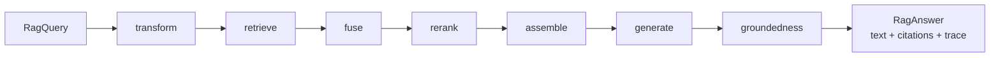
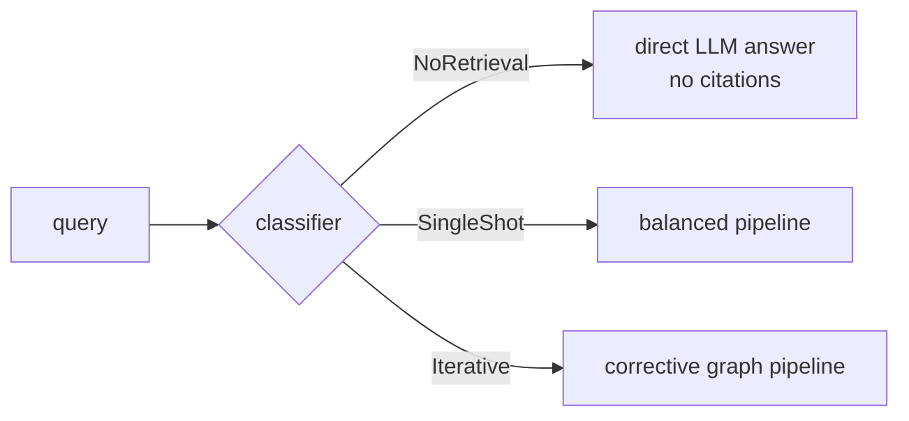
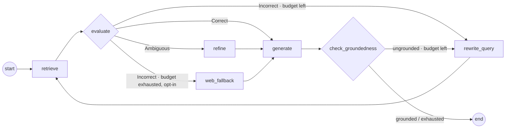

> **See also**: [ADR-006 — RAG subsystem](../adr/ADR-006-rag-subsystem.md) · [Memory system](./memory-system.md) · [Opt-in subsystems](../reference/opt-in-subsystems.md) · [Back to index](../INDEX.md)

# RAG pipeline

Retrieval-Augmented Generation subsystem (`src/rag/`): incremental ingestion with
security validation, a staged query pipeline (transform → retrieve → fuse → rerank →
assemble → generate → groundedness) whose every stage is traced, hybrid BM25 + vector
retrieval, pluggable rerankers, a corrective CRAG graph built on the in-house Graph
orchestration mode, quality profiles (`fast` / `balanced` / `quality` / `adaptive` /
`corrective`), YAML crew integration with cited knowledge injection, and an offline
evaluation harness gated in CI.

## Overview

An agent that pastes whole documents into its prompt drowns its context and cannot
cite anything. The RAG subsystem precomputes and structures that knowledge:

- **Ingestion**: documents are loaded (files, CSV, HTML, PDF, web pages), validated
  against prompt injection, chunked, embedded, and upserted into a collection of the
  document store. A per-collection manifest makes re-ingestion incremental — an
  unchanged source costs zero embeddings.
- **Query**: a question flows through a fixed sequence of togglable stages and comes
  back as a `RagAnswer` — generated text with `[n]` citation markers, the citations
  resolving each marker to its source chunk (score and offsets included), and the
  full execution trace of the run.
- **Quality dials**: one knob (`Orkeon:Rag:Profile`) selects a preset; every value
  can then be overridden key by key through configuration. Profile = preset,
  configuration = override.

Three consumption surfaces share the same pipelines: agent tools (`rag_search`,
`rag_ingest`, `rag_eval` in `Orkeon.Tools.Rag`), the crew YAML `rag:` /
`knowledge:` blocks, and the scripting DSL `rag.*` namespace.

## Projects (ADR-006)

| Project | Role | Depends on |
|---|---|---|
| `Orkeon.Rag.Abstractions` | Contracts, DTOs, options (`IRagPipeline`, `RagAnswer`, `RagOptions`, `RagProfilePresets`…) | `Orkeon.Domain` only |
| `Orkeon.Rag` | Implementations: loaders, chunkers, validation, stores, retrieval, reranking, routing, evaluation, DI | `Application`, `Analysis.Abstractions` (see ADR-006) |
| `Orkeon.Rag.Onnx` | Opt-in ONNX cross-encoder reranker (ms-marco-MiniLM-L-6-v2), `AddOrkeonOnnxReranker()` | `Orkeon.Rag.Abstractions` |
| `Orkeon.Rag.Onnx.Model` | Companion package embedding the int8 model weights — guaranteed offline | — |
| `Orkeon.Tools.Rag` | Agent tools `rag_search` / `rag_ingest` / `rag_eval`, `AddOrkeonRagTools()` | `Orkeon.Rag.Abstractions` |

`Orkeon.Rag.Abstractions` is a secondary shared kernel (same status as
`Orkeon.Analysis.Abstractions`, [ADR-003](../adr/ADR-003-shared-kernels-secondaires.md)):
`Orkeon.Application` references it for the ports; `Orkeon.Infrastructure` references
`Orkeon.Rag` solely as DI composition wiring. The legacy
`Orkeon.Infrastructure.Knowledge` / `Orkeon.Application.{Interfaces.Rag,Rag}`
namespaces were removed without shims (migration table in `CHANGELOG.md`).

## Quick start

The subsystem is opt-in — nothing is wired by `AddOrkeonInfrastructure()` alone:

```csharp
services.AddOrkeonLocalEmbeddings();      // or any IEmbeddingProvider (local BGE: no API key)
services.AddOrkeonInfrastructure();       // semantic-first defaults for embeddings + chat
services.AddOrkeonRag(configuration);     // the subsystem (Orkeon.Rag.DependencyInjection)
services.AddOrkeonRagTools();             // optional: rag_search / rag_ingest / rag_eval tools
```

```csharp
var ingestion = provider.GetRequiredService<IIngestionPipeline>();
await ingestion.IngestAsync(new IngestionRequest
{
    Collection = "product-kb",
    Sources = [new SourceDescriptor { Location = "/kb/faq.md" }],
});

var rag = provider.GetRequiredService<IRagPipeline>();
var answer = await rag.QueryAsync(new RagQuery
{
    Text = "How many days do customers have to request a refund?",
    Collection = "product-kb",
    TopN = 3,
});
// answer.Text        — generated text with [n] markers
// answer.Citations   — marker -> chunk id, source id, snippet, score, offsets
// answer.Trace       — stages executed, variants, route, verdicts
```

The host must provide an `IEmbeddingProvider` and an `IChatClient`;
`AddOrkeonInfrastructure()` registers semantic-first defaults for both (resolution
order for embeddings: container-registered local/Analysis provider →
`Orkeon:Embeddings` configuration → fail-fast at first use, never silently).

Runnable, fully offline demos: `examples/rag/basic-ingestion`,
`examples/rag/hybrid-retrieval`, `examples/rag/custom-reranker`,
`examples/rag/crew-yaml`, and the scripting variant `examples/scripting/08-rag.ork.ts`.

## Contracts

All in `Orkeon.Rag.Abstractions` (`Interfaces/`, `Models/`, `Options/`):

| Contract | Role |
|---|---|
| `IRagPipeline` | Query façade: `RagQuery` → `RagAnswer` (citations + trace) |
| `IRagRetrievalCapable` | Opt-in: the retrieval half alone (`transform → retrieve → fuse → rerank → assemble`), no generation, no LLM call |
| `IIngestionPipeline` | Ingestion façade: `IngestionRequest` → `IngestionReport` |
| `IDocumentStore` | Upsert / search / delete-by-source over a named collection |
| `IDocumentLoader` | Source → `RagDocument` (text, CSV, HTML, PDF, web page) |
| `IChunkingStrategy` | Document → `Chunk` slices (`recursive`, `sentence`, `structural`, `semantic`) |
| `IQueryTransformer` | Query → retrieval texts + a `QueryTransformKind` (see below) |
| `IReranker` | Candidates → best `topN`, reranker-scored (cascade CandidateK → TopN) |
| `IQueryComplexityClassifier` | Query → `QueryRoute` (`NoRetrieval` / `SingleShot` / `Iterative`) |
| `IRagProfileResolver` | Profile name → memoized pipeline instance |
| `IKnowledgeContextAugmenter` | Agent knowledge attachments → cited prompt block |
| `IRagCollectionsBootstrapper` | Crew `rag:` block → kickoff ingestion |
| `IRetrievalEvaluator`, `IGroundednessChecker` | Corrective hooks (verdicts, hallucination check — see [Corrective RAG](#corrective-rag-crag)) |
| `IRagEvaluator`, `IRagEvalHarness`* | Offline evaluation (metrics, golden datasets) |

\* the harness contract and its runner live in `Orkeon.Rag.Evaluation`; the
evaluator port is in the abstractions.

Named components (chunkers, transformers, rerankers) resolve through factories
following the `MemoryProviderFactory` pattern: names and aliases matched
case-insensitively, and an unknown name **always fails loudly** with the list of
known names — never a silent fallback.

## Staged query pipeline

`StagedRagPipeline` (default `IRagPipeline`) is a fixed sequence of togglable
stages driven by `RagOptions`:



| # | Stage | What it does | Trace data (excerpt) |
|---|---|---|---|
| 1 | `transform` | Named transformer produces retrieval texts (`none` skips) | `mode`, `kind`, `variants`, `variant_n` |
| 2 | `retrieve` | `CandidateK` candidates **per retrieval text**; hybrid honoured per query by capable stores | `candidates`, `top_k`, `mode`, `hybrid`, `variants` |
| 3 | `fuse` | Per-kind combination of the per-text rankings + dedup by chunk id, then opt-in MMR | `method` (`rrf`/`union`/`dedup`), `in`, `out`, `mmr*` |
| 4 | `rerank` | Named reranker, cascade CandidateK → TopN (disabled: truncation in retrieval order) | `reranker`, `candidates`, `kept` |
| 5 | `assemble` | Token budget (≈ 4 chars/token) + anti-Lost-in-the-Middle `edges` ordering | `chunks`, `ordering`, `dropped_by_budget` |
| 6 | `generate` | Grounded generation with `[n]` markers (anti-hallucination system prompt) | `model` |
| 7 | `groundedness` | Optional post-generation verification hook (`IGroundednessChecker`) | `grounded`, `score` |

Every stage appends a `RagTraceStep` to `RagAnswer.Trace` — durations, counts, and
chosen component names are always observable. When retrieval yields no candidate,
generation is skipped and a deterministic no-context answer is returned (the
pipeline never lets the model answer ungrounded).

### Query transformers by kind

Transformers declare how their output texts combine at the `fuse` stage
(`QueryTransformKind`):

| Kind | Built-in | Semantics |
|---|---|---|
| `Union` | `multi-query` | Retrieve once per text (original + variants); merge by chunk-id union, original store scores kept — the maximum wins on duplicates |
| `Fusion` | `rag-fusion` | Retrieve once per text; fuse the rankings by Reciprocal Rank Fusion (same `RrfK` as the hybrid stage) |
| `Replacement` | `hyde` | The substitute text(s) are the retrieval probes **instead of** the question — generation and citations always use the original question |

Built-ins registered by `AddOrkeonRag`: `none`, `multi-query`, `rag-fusion`,
`hyde`. The LLM-backed ones resolve the host's `IChatClient` lazily; parsing of
the LLM's variants is tolerant, and an empty output degrades to the original
query.

### Anti-Lost-in-the-Middle assembly

With `Context.Ordering: edges` (the default), ranked chunks r1 (best) … rm are
laid out as `r1, r3, r5, …` from the head and `…, r6, r4, r2` closing the tail —
the two strongest chunks sit at the extremities where LLM attention is highest,
the weakest in the middle. Citation markers stay **rank-based** (`[1]` = best
chunk) whatever the layout. `linear` restores plain rank order.

## Hybrid retrieval (BM25 + RRF)

`AddOrkeonRag` **always** wraps the registered `IDocumentStore` — including a
host-registered one — in the `HybridSearchDocumentStore` decorator, so ingestion
feeds an in-process per-collection BM25 index alongside the vector store. Whether
a search actually fuses is decided **per query** (`RetrievalQuery.Hybrid`, set by
the profile presets), with `Orkeon:Rag:Retrieval:Hybrid:Enabled` as the default
mode; a disabled default is a strict behavioural passthrough.

Score provenance (`ScoredChunk.ScoreOrigin`):

1. `hybrid-native` — the backing memory provider implements
   `IHybridSearchCapable` (e.g. LanceDB): text + vector fused provider-side.
2. `rrf` — emulated path: inner vector ranking + in-process BM25, fused with
   Reciprocal Rank Fusion. RRF scores are rank aggregates, **not** similarities.
3. Inner origin (`vector` / `local-cosine`) — passthrough when the lexical side
   has nothing to contribute.

The in-process BM25 index only covers chunks upserted through the decorator in
the current process; at scale, prefer a provider with native hybrid search — the
decorator switches to it automatically.

## MMR diversification

Opt-in (`Orkeon:Rag:Retrieval:Mmr:Enabled`), applied at the `fuse` stage:
Maximal Marginal Relevance re-orders the fused candidates by trading relevance
against redundancy — each pick maximises
`λ·relevance − (1 − λ)·max-similarity-to-already-picked` (default `λ = 0.7`,
relevance-leaning). Candidate embeddings are not re-computed: the lexical
(Jaccard) similarity fallback is the honest default.

## Reranking

The `rerank` stage narrows `CandidateK` candidates (default 50) to `TopN`
(default 5) with a named `IReranker`:

| Name (aliases) | Implementation | Notes |
|---|---|---|
| `none` (`noop`) | `NoopReranker` | Truncation in retrieval order |
| `llm` (`listwise`) | `LlmListwiseReranker` | One listwise chat call; tolerant parsing; fallback when no ONNX package |
| `onnx` (`cross-encoder`) | `Orkeon.Rag.Onnx` | ms-marco-MiniLM-L-6-v2 cross-encoder, int8 weights embedded, fully offline; `AddOrkeonOnnxReranker()` |

Hosts contribute rerankers through `IRerankerRegistrar` — registered in DI,
applied when the singleton `RerankerFactory` is built, registration order
irrelevant (this is how the ONNX package plugs in; see
`examples/rag/custom-reranker` for a host-provided one). The factory itself is
`TryAdd`-registered: a host-registered `RerankerFactory` wins outright.

## Profiles

`RagProfilePresets` expands a profile name into a complete `RagOptions`; the
`Orkeon:Rag` configuration section then overrides any value individually.

| | `fast` (default) | `balanced` | `quality` | `adaptive` | `corrective` |
|---|---|---|---|---|---|
| Retrieval | vector only, `CandidateK = TopK` | hybrid BM25 + RRF, `CandidateK = 50` | hybrid, `CandidateK = 100` | routed (see below) | hybrid, graph `retrieve` node (see [CRAG](#corrective-rag-crag)) |
| Rerank | off | ONNX cross-encoder 50 → 5 | ONNX cross-encoder | routed | none — the graph corrects by looping, not reranking |
| Groundedness | off | off | on | routed | native `check_groundedness` graph node |
| Needs | nothing | `Orkeon.Rag.Onnx` | `Orkeon.Rag.Onnx` | classifier + chat client | chat client (grader/rewrite; heuristic fallbacks without one) |

`fast` is the out-of-the-box default because `balanced` requires the opt-in ONNX
package — defaulting to it would make every bare `AddOrkeonRag()` host fail
loudly at first query. Opt into `balanced` with one configuration line.

`IRagProfileResolver` (`ProfileRagPipelineResolver`) memoizes **one pipeline per
profile name**; the reserved name `default` resolves to the host's registered
`IRagPipeline`, so a host-provided pipeline keeps the last word for non-profiled
queries. Unknown names fail loudly with the list of known profiles.

## Adaptive routing (Adaptive-RAG)

The `adaptive` profile resolves to an `AdaptiveRagPipeline`: an
`IQueryComplexityClassifier` routes each query first, and the decision is always
traced (`RagTrace.Route` + a `route` step carrying classifier, route, delegate).



Classifiers (`Orkeon:Rag:QueryRouting:Classifier`): `heuristic` (default —
deterministic rules, zero LLM call) or `llm` (one constrained lightweight chat
call; when selected without an `IChatClient` the heuristic is the documented
fallback, with a warning).

Since RAG-06 the `Iterative` route delegates to the memoized **`corrective`**
graph pipeline (see [Corrective RAG](#corrective-rag-crag)) — the RAG-05
documented fallback to `quality` is lifted. The `route` trace step carries
`delegate=corrective` and `RagTrace.Route` records the decision.

## Configuration reference (`Orkeon:Rag`)

Bound over the selected preset — every key is an individual override.

| Key | Default | Meaning |
|---|---|---|
| `Orkeon:Rag:Profile` | `fast` | Preset: `fast` / `balanced` / `quality` / `adaptive` / `corrective` (unknown fails loudly) |
| `Orkeon:Rag:Collection` | — | Default collection when the call site names none |
| `Orkeon:Rag:Provider` | ambient | Document-store provider alias (`inmemory`, `redis`, `sqlite`, `chromadb`, `pinecone`, `lancedb`…); unset = ambient `IMemoryProvider` |
| `Orkeon:Rag:ConnectionString` / `ProviderOptions:*` | — | Passed to the memory-provider factory when `Provider` is set |
| `Orkeon:Rag:Retrieval:TopK` | 5 | Chunks kept for context assembly (call-site `RagQuery.TopN` wins) |
| `Orkeon:Rag:Retrieval:CandidateK` | 50 | Wide stage of the cascade (always ≥ final TopN) |
| `Orkeon:Rag:Retrieval:MinScore` | none | Optional raw-score floor (the legacy global 0.7 floor is deliberately gone) |
| `Orkeon:Rag:Retrieval:Hybrid:Enabled` | false (`fast`) | Default hybrid mode; flat shorthand `Retrieval:Hybrid = true` accepted |
| `Orkeon:Rag:Retrieval:Hybrid:RrfK` | 60 | Reciprocal Rank Fusion constant |
| `Orkeon:Rag:Retrieval:Mmr:Enabled` | false | MMR diversification at the fuse stage |
| `Orkeon:Rag:Retrieval:Mmr:Lambda` | 0.7 | Relevance/diversity trade-off in [0, 1] |
| `Orkeon:Rag:QueryTransform:Mode` | `none` | `none` / `multi-query` / `rag-fusion` / `hyde` |
| `Orkeon:Rag:QueryTransform:VariantCount` | 3 | Variants requested from non-`none` transformers |
| `Orkeon:Rag:Rerank:Enabled` | false (`fast`) | Whether the rerank stage runs |
| `Orkeon:Rag:Rerank:Kind` | `none` | `none` / `llm` / `onnx` / any registered name |
| `Orkeon:Rag:Rerank:TopN` | 5 | Chunks kept after reranking |
| `Orkeon:Rag:Context:MaxTokens` | 2000 | Context budget (≈ 4 chars/token; excess chunks dropped, never overrun) |
| `Orkeon:Rag:Context:Ordering` | `edges` | `edges` (anti-Lost-in-the-Middle) or `linear` |
| `Orkeon:Rag:Groundedness:Enabled` | false | Post-generation verification (traced as skipped without a checker) |
| `Orkeon:Rag:Generation:SystemPrompt` | built-in | Grounded system prompt override |
| `Orkeon:Rag:Generation:Temperature` / `MaxOutputTokens` | — | Sampling passed to the chat client |
| `Orkeon:Rag:QueryRouting:Classifier` | `heuristic` | `heuristic` or `llm` (adaptive profile) |
| `Orkeon:Rag:Corrective:MaxIterations` | 3 | Corrective iteration budget — query rewrites, whether triggered by an `Incorrect` verdict or an ungrounded answer |
| `Orkeon:Rag:Corrective:WebFallback:Enabled` | false | Pipeline-side policy: may the corrective graph route to its `web_fallback` node |
| `Orkeon:Rag:Corrective:WebFallback:MaxResults` | 3 | Web documents the graph asks the retriever for |
| `Orkeon:Rag:WebFallback:*` | disabled | **Separate section** — transport of the web retriever (`Enabled`, `Endpoint`, `ApiKeyEnvVar`, `MaxResults`, `Timeout`, `SuspiciousAction`); see [Web fallback](#web-fallback--opt-in-injection-validated) |
| `Orkeon:Rag:Ingestion:DefaultChunkingStrategy` | `recursive` | Strategy when a request names none |
| `Orkeon:Rag:Ingestion:ManifestDirectory` | `/output/rag/manifests` | VFS directory of the per-collection manifests |

## Ingestion

`DefaultIngestionPipeline` runs: load (`DocumentLoaderFactory` selects by source
kind/extension — text, CSV, HTML, PDF, `WebPageLoader` for URLs) → **security
validation** → chunk (named strategy) → embed → upsert.

- **Validation** (ingestion-path security): `PromptInjectionDocumentValidator`
  and `ContentIntegrityValidator` run on every document; rejected content goes to
  the `IQuarantineStore` and provenance is recorded (`IProvenanceTracker`).
  Details and threat model in [security.md](./security.md).
- **Incremental manifest** (per collection, one JSON file written through the
  VFS at `{ManifestDirectory}/{collection}.json`): each source's content hash and
  the embedding profile (provider, model, dimensions) are recorded. Unchanged
  sources are skipped entirely — `chunksEmbedded = 0`; changed ones are purged
  and re-ingested. Failure posture: a missing/corrupt manifest degrades to full
  ingestion, an unwritable manifest directory degrades to a warning (ingestion
  works, just never incrementally) — never a crash.
- **`Reindex = true`** purges every recorded source and rebuilds the collection.
  It is also the only way to re-ingest after an embedding-profile change:
  a drift between the manifest's recorded profile and the active provider fails
  the run loudly rather than silently mixing incompatible vectors.
- Glob sources (`*`, `**`, `?`) are expanded through the VFS by
  `SourceGlobExpander` at the consuming surfaces (scripting `rag.ingest`,
  `rag_ingest` tool, eval harness corpus).

## Crew YAML integration

Two YAML blocks, consumed at different moments (see `examples/rag/crew-yaml`):

```yaml
rag:                        # crew-level: collections ingested at crew creation
  collections:
    product-kb:
      sources: [/kb/faq.md]
      chunking: { strategy: recursive, max_tokens: 256, overlap: 32 }

agents:
  support:
    role: Support agent
    goal: Answer from the knowledge base
    knowledge: [product-kb] # agent-level: retrieval attachment
```

- The `rag:` block is parsed into `RagCrewConfig`; `CrewFactory` hands it to the
  `IRagCollectionsBootstrapper` at `CreateFromConfigAsync` — kickoff-time
  ingestion through the incremental pipeline (a fresh manifest makes it a
  no-op). A crew declaring `rag:` on a host without `AddOrkeonRag` logs a
  warning instead of failing.
- `knowledge:` attachments travel on the `Agent` aggregate; at task-context
  assembly the execution orchestrator calls `IKnowledgeContextAugmenter`, which
  retrieves from the attached collections (retrieval only — no nested LLM call)
  and injects a bounded, numbered block with `[n]` citations into the agent's
  prompt.

## Scripting and CLI surfaces

- **Scripting DSL** (`.ork.ts`): first-class `rag.ingest({ collection, sources,
  chunkingStrategy?, reindex? })`, `rag.query(question, { collection, profile?,
  topN? })` and `rag.retrieve(question, { … })` globals — see
  `examples/scripting/08-rag.ork.ts`. The namespace is always registered; calls
  fail with an actionable message when the host did not wire the subsystem.
  `query` and `retrieve` return the same payload shape and only `query` runs the
  generation stage, so a script that reads only `citations` should call
  `retrieve` — see below.
- **CLI** (`orkeon`): `orkeon rag ingest|search|eval` over the same pipelines.

## Retrieval without generation

`IRagRetrievalCapable.RetrieveAsync` runs stages 1-5 and stops. Same query, same
passages, no LLM call.

The reason it exists is a measurement rather than a preference: a caller that
quotes the retrieved passages — because it wants the evidence, not a summary of
it — was still paying for a grounded generation. On exp02's gap round
(2026-08-04) seven `rag.query` calls whose answers were discarded by design cost
**13 748 completion tokens, 74 % of them reasoning tokens, and 393 s of wall
time**. Nothing in the API let the caller stop after `assemble`.

```csharp
if (pipeline is IRagRetrievalCapable retriever)
{
    var answer = await retriever.RetrieveAsync(
        new RagQuery { Text = question, Collection = "kb", TopN = 6 });
    // answer.Text is empty; answer.Citations holds the assembled passages.
}
```

Two properties worth knowing before relying on it:

- **The capability is opt-in and must be probed.** `StagedRagPipeline` implements
  it; the corrective graph does not, because it interleaves retrieval evaluation
  with generation — "retrieval only" is not a prefix of its run. `rag.retrieve`
  throws on a pipeline that cannot honour it instead of falling back to
  `QueryAsync`, which would charge exactly what the caller asked to avoid.
- **The trace still carries a `generate` step**, whose detail says the stage was
  skipped on purpose. An absent step would read as a trace produced by an older
  pipeline.

## Evaluation (golden datasets, CI gate)

The offline harness (`IRagEvalHarness`, RAG-04/C1) turns retrieval quality into a
published number instead of a claim:

- **Dataset** (`examples/rag/eval/golden.yaml`): a corpus directory plus cases —
  `question`, `relevant` source refs (suffix-matched against ingested ids),
  `expected_substrings`, `reference_answer`, `tags`. The corpus is ingested
  (incrementally) before every run.
- **Metrics**: recall@k and MRR per case and aggregated; generation is judged by
  an LLM judge when available, with a deterministic heuristic fallback — the
  report always labels which judge ran.
- **Profiles compared** in one run: `orkeon rag eval --dataset … --compare
  fast,balanced,quality,corrective,adaptive --offline` (`--offline` swaps
  generation for a deterministic extractive stub — zero network; the measured
  table and its honest reading live in `examples/rag/eval/README.md`).
- **CI gate** (`.github/workflows/rag-eval.yml`): the comparison table is
  published to the step summary, and an anti-regression gate fails the build
  when the `balanced` profile's aggregate recall@5 or MRR drops below the
  floors. Cases tagged `correctif` are excluded from the gates: they are seeded
  to fail single-shot retrieval on purpose (see below).

## Corrective RAG (CRAG)

The `corrective` profile resolves to `CorrectiveRagPipeline`
(`Orkeon.Rag.Corrective`) — **CRAG built on Orkeon's Graph orchestration
mode**: the pipeline's execution *is* a `StateGraph<RagGraphState>` — the same
Domain `StateGraph<TState>` engine behind `ProcessType.Graph` — with conditional
edges, controlled cycles and the graph's native circuit breaker. The corrective
engine is not a bespoke loop bolted onto RAG; RAG demonstrates the `Graph`
orchestration mode and vice versa. Same `IRagPipeline` façade as every other
profile: the profile selects the executor, callers only ever see a `RagAnswer`.

### Graph topology



Every node run appends a `corrective:<node>` step (with the iteration ordinal)
to `RagAnswer.Trace`; verdicts accumulate in `RagTrace.Verdicts`, rewritten
probes in `RagTrace.QueryVariants`, the loop count in `RagTrace.Iterations`.

| Node | What it does |
|---|---|
| `retrieve` | Embeds the current probe (original question, or the latest rewrite) and searches `CandidateK` candidates — hybrid BM25 + RRF per the preset — keeping `TopN` |
| `evaluate` | `IRetrievalEvaluator` grades the chunks against the **original** question (the probe may have been rewritten, the information need has not) → `RetrievalVerdict` |
| `rewrite_query` | One constrained LLM call (temperature 0) rewrites the retrieval probe across the vocabulary gap, fed with the evaluator's rationale and any unsupported claims; loops back to `retrieve`. An unusable rewrite retries the previous probe but still consumes the budget — never an exception |
| `refine` | Decompose-then-recompose on `Ambiguous`: filters by the evaluator's per-chunk relevances (threshold 0.5), re-splits chunks into sentences and keeps the segments sharing vocabulary with the question — never empties the working set |
| `web_fallback` | Opt-in last resort after rewriting is exhausted (see below); skipped and traced otherwise |
| `generate` | Grounded generation answering the **original** user question — never the rewritten probe — with the same rank-based `[n]` markers, token budget and anti-Lost-in-the-Middle `edges` layout as the staged pipeline |
| `check_groundedness` | `IGroundednessChecker` verifies the answer against the context; ungrounded → re-loop through `rewrite_query`; without a registered checker the node is traced as skipped and the graph ends |

The two decision points are conditional edges: after `evaluate` →
`[generate | rewrite_query | refine | web_fallback]`, after
`check_groundedness` → `[rewrite_query | end]`.

### Verdicts (`Correct | Incorrect | Ambiguous`)

- `Correct` → straight to `generate`.
- `Ambiguous` → `refine`, then `generate`.
- `Incorrect` → `rewrite_query` while the iteration budget lasts; at exhaustion
  the opt-in web fallback fires (only when enabled **and** a retriever is
  registered **and** it has not been attempted yet), else best-effort
  generation with the best available chunks — every skip is traced with its
  reason (`disabled`, `no IWebDocumentRetriever registered`, `already
  attempted`).

Default evaluator and checker (registered by `AddOrkeonCorrectiveRag`, itself
called by `AddOrkeonRag`): LLM-backed when an `IChatClient` is registered —
`LlmRetrievalEvaluator` and `LlmGroundednessChecker`, constrained via
`LlmResponseFormat` (`json_object` where the provider wires it, e.g. DeepSeek;
tolerant JSON parsing elsewhere) — otherwise the deterministic
`HeuristicRetrievalEvaluator` / `HeuristicGroundednessChecker` with a warning.

### Double bound — the loop can never run away

1. **`Corrective.MaxIterations`** (default 3): the routing never re-enters
   `rewrite_query` past the budget — this bounds both the `Incorrect` rewrite
   cycle and the groundedness re-loop.
2. **Graph circuit breaker**: the `StateGraph` engine's own
   `CircuitBreakerPolicy`, explicitly derived from the budget
   (`MaxTransitions = (n+2)×7`, `MaxStateVisits = n+2`, per-state timeout
   2 min, total 10 min) — a second, independent layer that only trips if the
   routing invariants are ever violated. A tripped breaker is caught, traced
   (`corrective:circuit_breaker`) and degraded to a best-effort answer
   (generation runs outside the graph if it had not run yet). The pipeline
   never throws for a loop condition.

### Groundedness is native to the graph

The `corrective` preset deliberately keeps `Groundedness.Enabled = false`: that
flag toggles the *staged* pipeline's optional stage 7, whereas the graph runs
its own `check_groundedness` node whenever an `IGroundednessChecker` is
registered. Honouring the flag here would be dead configuration at best and a
double check if the preset ever fed a linear pipeline.

### Web fallback — opt-in, injection-validated

Two deliberately separate configuration sections; **both** `Enabled` switches
are off by default and both must be on for a web document to ever reach the
graph:

| Section | Type | Concern |
|---|---|---|
| `Orkeon:Rag:Corrective:WebFallback` (`Enabled`, `MaxResults`) | `RagWebFallbackOptions` (Abstractions) | Pipeline-side policy: may the graph route to `web_fallback`, and for how many documents |
| `Orkeon:Rag:WebFallback` (`Enabled`, `Endpoint`, `ApiKeyEnvVar`, `MaxResults`, `Timeout`, `SuspiciousAction`) | `WebSearchRetrieverOptions` (`Orkeon.Rag.WebFallback`) | HTTP transport: SearxNG-compatible JSON search + page download + suspicious-content policy |

The split is architectural, not accidental: the Abstractions shared kernel is
Domain+BCL-only (ADR-006), and web egress is its own explicit opt-in.
`AddOrkeonRagWebFallback(configuration)` registers the `IWebDocumentRetriever`
(`WebSearchDocumentRetriever`) — enabled-but-unconfigured stays inert with a
warning, and the API key only ever comes from the `ApiKeyEnvVar` environment
variable. Every downloaded page passes `PromptInjectionDocumentValidator`:
`Rejected` content never leaves the retriever, `Suspicious` content is flagged
in metadata or discarded per `SuspiciousAction`, and content is never
rewritten. Threat model, detected signals and honest limits:
[security.md](./security.md#rag-web-fallback--prompt-injection). Web chunks
carry `ScoreOrigin = "web"` and open the working set; the locally retrieved
chunks — just graded `Incorrect` — close it.

### Profiles `corrective` and `adaptive`

The `corrective` preset feeds the graph's nodes: hybrid BM25 + RRF retrieval
(rewritten probes need the lexical leg to bridge vocabulary gaps) and **no
linear rerank stage** — the graph corrects through evaluate → rewrite loops
instead of reranking, so the profile needs no opt-in ONNX package. Since
RAG-06 the `adaptive` profile's `Iterative` route delegates to the memoized
`corrective` pipeline (fallback to `quality` lifted, `route` step traces
`delegate=corrective`).

### Measured honesty

The end-to-end mechanism — grader verdict `Incorrect` → LLM rewrite →
re-retrieve → `notes-power.md` cited on the seeded q-007 case where `quality`
misses it — is proven by
`tests/e2e/Orkeon.E2E.Tests/CorrectiveRagMechanismSlowTests.cs` (real BGE
embeddings, real hybrid store; the LLM is scripted for the two roles CI cannot
provide, and labelled as such). In the fully offline eval table `corrective`
scores **0.78 recall@5 / 0.64 MRR — below `quality`**: the extractive stub
degrades the graph's LLM nodes (pseudo-random verdicts, degenerate rewrite
probe). That artifact is analysed line by line in
`examples/rag/eval/README.md` — published as measured, not smoothed over.

## Architecture decisions

The RAG subsystem's decision record is
[ADR-006](../adr/ADR-006-rag-subsystem.md) (shared-kernel status of
`Orkeon.Rag.Abstractions`, allowed couplings, legacy namespaces removed without
shims). The phase decisions layered on top of it: the double ONNX package
(`Orkeon.Rag.Onnx` runtime + `Orkeon.Rag.Onnx.Model` embedded int8 weights —
guaranteed offline, RAG-04), profile presets + per-key overrides with `fast` as
the safe default (RAG-04), query transformers with per-kind fusion semantics
(RAG-05), CRAG built on the Domain `StateGraph` rather than a bespoke loop
(RAG-06), and the strictly opt-in, injection-validated web fallback with its
policy/transport section split (RAG-06, this page and ADR-006).

## V1 limitations

- The in-process BM25 index is per-process and unpersisted; native hybrid
  (LanceDB) is preferred at scale — automatic when the provider supports it.
- MMR uses lexical similarity between candidates (embeddings are not
  re-computed at the fuse stage).
- `balanced` / `quality` require the opt-in ONNX packages; without them use
  `Rerank:Kind = llm` or stay on `fast`.
- Without a real `IChatClient` the corrective graph's LLM nodes (grader,
  rewrite, groundedness) degrade — offline evaluation measures the loop's guard
  rails, not rewrite quality (honest analysis in `examples/rag/eval/README.md`
  and [limitations](../reference/limitations.md)).
- The web fallback's anti-injection heuristics are pattern-based and evadable
  ([security.md](./security.md)); the fallback is opt-in and not exercised
  against a real network in CI.
