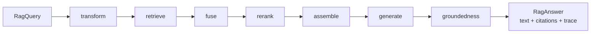
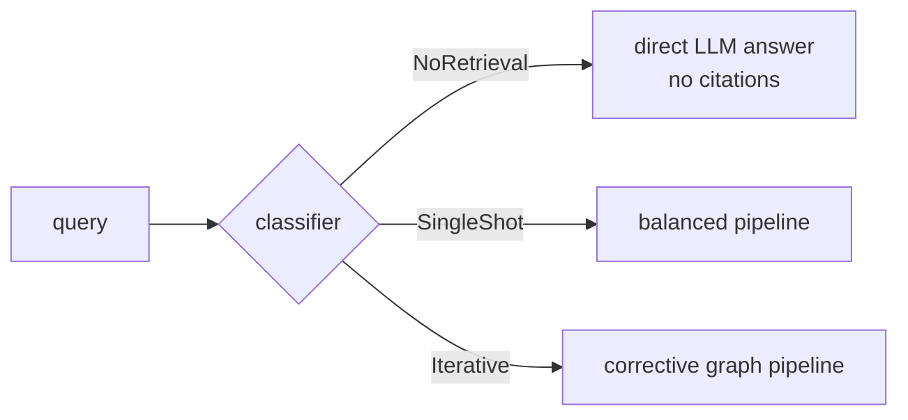
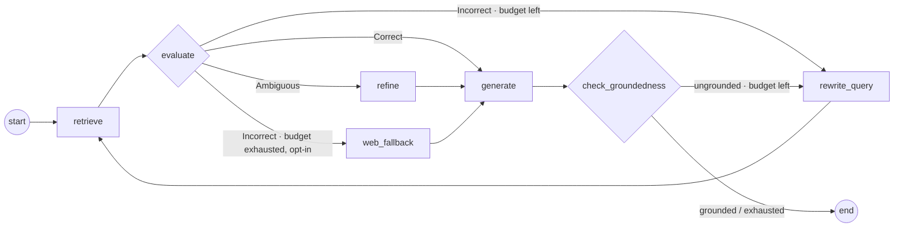

> 🇬🇧 [English version](../../architecture/rag-pipeline.md)

> **Voir aussi** : [ADR-006 — Sous-système RAG](../adr/ADR-006-rag-subsystem.md) · [Système de mémoire](./memory-system.md) · [Sous-systèmes opt-in](../reference/opt-in-subsystems.md) · [Retour à l'index](../INDEX.md)

# Pipeline RAG

Sous-système Retrieval-Augmented Generation (`src/rag/`) : ingestion incrémentale avec
validation de sécurité, pipeline de requête étagé (transform → retrieve → fuse → rerank →
assemble → generate → groundedness) dont chaque étape est tracée, retrieval hybride BM25 +
vectoriel, rerankers enfichables, graphe correctif CRAG construit sur le mode d'orchestration
Graph maison, profils de qualité (`fast` / `balanced` / `quality` / `adaptive` /
`corrective`), intégration crew YAML avec injection de connaissances citées, et harnais
d'évaluation offline sous gate CI.

## Vue d'ensemble

Un agent qui colle des documents entiers dans son prompt noie son contexte et ne peut rien
citer. Le sous-système RAG précalcule et structure cette connaissance :

- **Ingestion** : les documents sont chargés (fichiers, CSV, HTML, PDF, pages web), validés
  contre l'injection de prompt, découpés en chunks, embarqués sous forme d'embeddings et
  upsertés dans une collection du document store. Un manifeste par collection rend la
  ré-ingestion incrémentale — une source inchangée coûte zéro embedding.
- **Requête** : une question traverse une séquence fixe d'étapes activables et revient sous
  forme de `RagAnswer` — texte généré avec des marqueurs de citation `[n]`, les citations
  résolvant chaque marqueur vers son chunk source (score et offsets inclus), et la trace
  d'exécution complète de la passe.
- **Réglages de qualité** : un seul bouton (`Orkeon:Rag:Profile`) sélectionne un preset ;
  chaque valeur peut ensuite être surchargée clé par clé via la configuration.
  Profil = preset, configuration = surcharge.

Trois surfaces de consommation partagent les mêmes pipelines : les outils agents
(`rag_search`, `rag_ingest`, `rag_eval` dans `Orkeon.Tools.Rag`), les blocs YAML de crew
`rag:` / `knowledge:`, et l'espace de noms `rag.*` du DSL de scripting.

## Projets (ADR-006)

| Projet | Rôle | Dépend de |
|---|---|---|
| `Orkeon.Rag.Abstractions` | Contrats, DTOs, options (`IRagPipeline`, `RagAnswer`, `RagOptions`, `RagProfilePresets`…) | `Orkeon.Domain` uniquement |
| `Orkeon.Rag` | Implémentations : loaders, chunkers, validation, stores, retrieval, reranking, routage, évaluation, DI | `Application`, `Analysis.Abstractions` (voir ADR-006) |
| `Orkeon.Rag.Onnx` | Reranker cross-encoder ONNX opt-in (ms-marco-MiniLM-L-6-v2), `AddOrkeonOnnxReranker()` | `Orkeon.Rag.Abstractions` |
| `Orkeon.Rag.Onnx.Model` | Package compagnon embarquant les poids int8 du modèle — offline garanti | — |
| `Orkeon.Tools.Rag` | Outils agents `rag_search` / `rag_ingest` / `rag_eval`, `AddOrkeonRagTools()` | `Orkeon.Rag.Abstractions` |

`Orkeon.Rag.Abstractions` est un shared kernel secondaire (même statut que
`Orkeon.Analysis.Abstractions`, [ADR-003](../adr/ADR-003-shared-kernels-secondaires.md)) :
`Orkeon.Application` le référence pour les ports ; `Orkeon.Infrastructure` référence
`Orkeon.Rag` uniquement comme câblage de composition DI. Les anciens namespaces
`Orkeon.Infrastructure.Knowledge` / `Orkeon.Application.{Interfaces.Rag,Rag}` ont été
supprimés sans shims (table de migration dans `CHANGELOG.md`).

## Démarrage rapide

Le sous-système est opt-in — `AddOrkeonInfrastructure()` seul ne câble rien :

```csharp
services.AddOrkeonLocalEmbeddings();      // or any IEmbeddingProvider (local BGE: no API key)
services.AddOrkeonInfrastructure();       // semantic-first defaults for embeddings + chat
services.AddOrkeonRag(configuration);     // the subsystem (Orkeon.Rag.DependencyInjection)
services.AddOrkeonRagTools();             // optional: rag_search / rag_ingest / rag_eval tools
```

```csharp
var ingestion = provider.GetRequiredService<IIngestionPipeline>();
await ingestion.IngestAsync(new IngestionRequest
{
    Collection = "product-kb",
    Sources = [new SourceDescriptor { Location = "/kb/faq.md" }],
});

var rag = provider.GetRequiredService<IRagPipeline>();
var answer = await rag.QueryAsync(new RagQuery
{
    Text = "How many days do customers have to request a refund?",
    Collection = "product-kb",
    TopN = 3,
});
// answer.Text        — generated text with [n] markers
// answer.Citations   — marker -> chunk id, source id, snippet, score, offsets
// answer.Trace       — stages executed, variants, route, verdicts
```

L'hôte doit fournir un `IEmbeddingProvider` et un `IChatClient` ;
`AddOrkeonInfrastructure()` enregistre pour les deux des défauts semantic-first (ordre de
résolution pour les embeddings : provider local/Analysis enregistré dans le conteneur →
configuration `Orkeon:Embeddings` → échec explicite au premier usage, jamais en silence).

Démos exécutables, entièrement offline : `examples/rag/basic-ingestion`,
`examples/rag/hybrid-retrieval`, `examples/rag/custom-reranker`,
`examples/rag/crew-yaml`, et la variante scripting `examples/scripting/08-rag.ork.ts`.

## Contrats

Tous dans `Orkeon.Rag.Abstractions` (`Interfaces/`, `Models/`, `Options/`) :

| Contrat | Rôle |
|---|---|
| `IRagPipeline` | Façade de requête : `RagQuery` → `RagAnswer` (citations + trace) |
| `IRagRetrievalCapable` | Opt-in : la moitié retrieval seule (`transform → retrieve → fuse → rerank → assemble`), pas de génération, aucun appel LLM |
| `IIngestionPipeline` | Façade d'ingestion : `IngestionRequest` → `IngestionReport` |
| `IDocumentStore` | Upsert / recherche / suppression par source sur une collection nommée |
| `IDocumentLoader` | Source → `RagDocument` (texte, CSV, HTML, PDF, page web) |
| `IChunkingStrategy` | Document → tranches `Chunk` (`recursive`, `sentence`, `structural`, `semantic`) |
| `IQueryTransformer` | Requête → textes de retrieval + un `QueryTransformKind` (voir plus bas) |
| `IReranker` | Candidats → meilleurs `topN`, scorés par le reranker (cascade CandidateK → TopN) |
| `IQueryComplexityClassifier` | Requête → `QueryRoute` (`NoRetrieval` / `SingleShot` / `Iterative`) |
| `IRagProfileResolver` | Nom de profil → instance de pipeline mémoïsée |
| `IKnowledgeContextAugmenter` | Pièces jointes de connaissance de l'agent → bloc de prompt cité |
| `IRagCollectionsBootstrapper` | Bloc `rag:` de la crew → ingestion au kickoff |
| `IRetrievalEvaluator`, `IGroundednessChecker` | Hooks correctifs (verdicts, contrôle d'hallucination — voir [RAG correctif](#rag-correctif-crag)) |
| `IRagEvaluator`, `IRagEvalHarness`* | Évaluation offline (métriques, datasets golden) |

\* le contrat du harnais et son runner vivent dans `Orkeon.Rag.Evaluation` ; le port
d'évaluation est dans les abstractions.

Les composants nommés (chunkers, transformers, rerankers) se résolvent via des factories
suivant le pattern `MemoryProviderFactory` : noms et alias comparés sans tenir compte de la
casse, et un nom inconnu **échoue toujours bruyamment** avec la liste des noms connus —
jamais de repli silencieux.

## Pipeline de requête étagé

`StagedRagPipeline` (implémentation `IRagPipeline` par défaut) est une séquence fixe
d'étapes activables, pilotée par `RagOptions` :



| # | Étape | Rôle | Données de trace (extrait) |
|---|---|---|---|
| 1 | `transform` | Le transformer nommé produit les textes de retrieval (`none` saute l'étape) | `mode`, `kind`, `variants`, `variant_n` |
| 2 | `retrieve` | `CandidateK` candidats **par texte de retrieval** ; l'hybride est honoré par requête par les stores qui en sont capables | `candidates`, `top_k`, `mode`, `hybrid`, `variants` |
| 3 | `fuse` | Combinaison par kind des classements par texte + dédoublonnage par id de chunk, puis MMR opt-in | `method` (`rrf`/`union`/`dedup`), `in`, `out`, `mmr*` |
| 4 | `rerank` | Reranker nommé, cascade CandidateK → TopN (désactivé : troncature dans l'ordre du retrieval) | `reranker`, `candidates`, `kept` |
| 5 | `assemble` | Budget de tokens (≈ 4 caractères/token) + ordonnancement `edges` anti-Lost-in-the-Middle | `chunks`, `ordering`, `dropped_by_budget` |
| 6 | `generate` | Génération ancrée avec marqueurs `[n]` (system prompt anti-hallucination) | `model` |
| 7 | `groundedness` | Hook optionnel de vérification post-génération (`IGroundednessChecker`) | `grounded`, `score` |

Chaque étape ajoute un `RagTraceStep` à `RagAnswer.Trace` — durées, décomptes et noms des
composants choisis sont toujours observables. Quand le retrieval ne rapporte aucun candidat,
la génération est sautée et une réponse déterministe « sans contexte » est renvoyée (le
pipeline ne laisse jamais le modèle répondre sans ancrage).

### Transformers de requête par kind

Les transformers déclarent comment leurs textes de sortie se combinent à l'étape `fuse`
(`QueryTransformKind`) :

| Kind | Intégré | Sémantique |
|---|---|---|
| `Union` | `multi-query` | Un retrieval par texte (original + variantes) ; fusion par union des ids de chunk, scores d'origine du store conservés — le maximum l'emporte sur les doublons |
| `Fusion` | `rag-fusion` | Un retrieval par texte ; fusion des classements par Reciprocal Rank Fusion (même `RrfK` que l'étape hybride) |
| `Replacement` | `hyde` | Le ou les textes de substitution sont les sondes de retrieval **à la place de** la question — la génération et les citations utilisent toujours la question originale |

Intégrés enregistrés par `AddOrkeonRag` : `none`, `multi-query`, `rag-fusion`, `hyde`. Ceux
qui s'appuient sur un LLM résolvent l'`IChatClient` de l'hôte paresseusement ; le parsing
des variantes du LLM est tolérant, et une sortie vide dégrade vers la requête originale.

### Assemblage anti-Lost-in-the-Middle

Avec `Context.Ordering: edges` (le défaut), les chunks classés r1 (meilleur) … rm sont
disposés en `r1, r3, r5, …` depuis la tête et `…, r6, r4, r2` pour fermer la queue — les
deux chunks les plus forts occupent les extrémités où l'attention du LLM est la plus forte,
les plus faibles se retrouvent au milieu. Les marqueurs de citation restent **fondés sur le
rang** (`[1]` = meilleur chunk) quelle que soit la disposition. `linear` restaure l'ordre de
rang simple.

## Recherche hybride (BM25 + RRF)

`AddOrkeonRag` enveloppe **toujours** l'`IDocumentStore` enregistré — y compris celui
enregistré par l'hôte — dans le décorateur `HybridSearchDocumentStore`, de sorte que
l'ingestion alimente un index BM25 in-process par collection à côté du store vectoriel. Le
fait qu'une recherche fusionne réellement se décide **par requête**
(`RetrievalQuery.Hybrid`, positionné par les presets de profil), avec
`Orkeon:Rag:Retrieval:Hybrid:Enabled` comme mode par défaut ; un défaut désactivé est un
passthrough comportemental strict.

Provenance des scores (`ScoredChunk.ScoreOrigin`) :

1. `hybrid-native` — le provider mémoire sous-jacent implémente `IHybridSearchCapable`
   (p. ex. LanceDB) : texte + vecteur fusionnés côté provider.
2. `rrf` — chemin émulé : classement vectoriel interne + BM25 in-process, fusionnés par
   Reciprocal Rank Fusion. Les scores RRF sont des agrégats de rangs, **pas** des
   similarités.
3. Origine interne (`vector` / `local-cosine`) — passthrough quand le versant lexical n'a
   rien à apporter.

L'index BM25 in-process ne couvre que les chunks upsertés via le décorateur dans le
processus courant ; à l'échelle, préférer un provider à recherche hybride native — le
décorateur bascule dessus automatiquement.

## Diversification MMR

Opt-in (`Orkeon:Rag:Retrieval:Mmr:Enabled`), appliquée à l'étape `fuse` : la Maximal
Marginal Relevance réordonne les candidats fusionnés en arbitrant pertinence contre
redondance — chaque sélection maximise
`λ·pertinence − (1 − λ)·similarité-max-aux-déjà-sélectionnés` (défaut `λ = 0.7`, penchant
pertinence). Les embeddings des candidats ne sont pas recalculés : le repli sur la
similarité lexicale (Jaccard) est le défaut honnête.

## Reranking

L'étape `rerank` resserre `CandidateK` candidats (défaut 50) vers `TopN` (défaut 5) à
l'aide d'un `IReranker` nommé :

| Nom (alias) | Implémentation | Notes |
|---|---|---|
| `none` (`noop`) | `NoopReranker` | Troncature dans l'ordre du retrieval |
| `llm` (`listwise`) | `LlmListwiseReranker` | Un appel de chat listwise ; parsing tolérant ; repli quand le package ONNX est absent |
| `onnx` (`cross-encoder`) | `Orkeon.Rag.Onnx` | Cross-encoder ms-marco-MiniLM-L-6-v2, poids int8 embarqués, entièrement offline ; `AddOrkeonOnnxReranker()` |

Les hôtes contribuent des rerankers via `IRerankerRegistrar` — enregistrés dans la DI,
appliqués à la construction du singleton `RerankerFactory`, ordre d'enregistrement
indifférent (c'est ainsi que le package ONNX se branche ; voir
`examples/rag/custom-reranker` pour un reranker fourni par l'hôte). La factory elle-même est
enregistrée en `TryAdd` : une `RerankerFactory` enregistrée par l'hôte l'emporte
purement et simplement.

## Profils

`RagProfilePresets` déplie un nom de profil en un `RagOptions` complet ; la section de
configuration `Orkeon:Rag` surcharge ensuite chaque valeur individuellement.

| | `fast` (défaut) | `balanced` | `quality` | `adaptive` | `corrective` |
|---|---|---|---|---|---|
| Retrieval | vectoriel seul, `CandidateK = TopK` | hybride BM25 + RRF, `CandidateK = 50` | hybride, `CandidateK = 100` | routé (voir plus bas) | hybride, nœud de graphe `retrieve` (voir [CRAG](#rag-correctif-crag)) |
| Rerank | désactivé | cross-encoder ONNX 50 → 5 | cross-encoder ONNX | routé | aucun — le graphe corrige en bouclant, pas en reclassant |
| Groundedness | désactivé | désactivé | activé | routé | nœud de graphe natif `check_groundedness` |
| Requiert | rien | `Orkeon.Rag.Onnx` | `Orkeon.Rag.Onnx` | classifieur + client de chat | client de chat (grader/réécriture ; replis heuristiques sans lui) |

`fast` est le défaut prêt à l'emploi parce que `balanced` exige le package ONNX opt-in — en
faire le défaut ferait échouer bruyamment, dès la première requête, tout hôte se contentant
d'un `AddOrkeonRag()` nu. On opte pour `balanced` avec une seule ligne de configuration.

`IRagProfileResolver` (`ProfileRagPipelineResolver`) mémoïse **un pipeline par nom de
profil** ; le nom réservé `default` se résout vers l'`IRagPipeline` enregistré par l'hôte,
de sorte qu'un pipeline fourni par l'hôte garde le dernier mot pour les requêtes sans
profil. Les noms inconnus échouent bruyamment avec la liste des profils connus.

## Routage adaptatif (Adaptive-RAG)

Le profil `adaptive` se résout vers un `AdaptiveRagPipeline` : un
`IQueryComplexityClassifier` route d'abord chaque requête, et la décision est toujours
tracée (`RagTrace.Route` + une étape `route` portant le classifieur, la route et le
délégué).



Classifieurs (`Orkeon:Rag:QueryRouting:Classifier`) : `heuristic` (défaut — règles
déterministes, zéro appel LLM) ou `llm` (un appel de chat léger et contraint ; sélectionné
sans `IChatClient`, l'heuristique est le repli documenté, avec un avertissement).

Depuis RAG-06, la route `Iterative` délègue au pipeline de graphe **`corrective`** mémoïsé
(voir [RAG correctif](#rag-correctif-crag)) — le repli vers `quality` documenté en RAG-05
est levé. L'étape de trace `route` porte `delegate=corrective` et `RagTrace.Route`
enregistre la décision.

## Référence de configuration (`Orkeon:Rag`)

Liée par-dessus le preset sélectionné — chaque clé est une surcharge individuelle.

| Clé | Défaut | Signification |
|---|---|---|
| `Orkeon:Rag:Profile` | `fast` | Preset : `fast` / `balanced` / `quality` / `adaptive` / `corrective` (un nom inconnu échoue bruyamment) |
| `Orkeon:Rag:Collection` | — | Collection par défaut quand l'appelant n'en nomme aucune |
| `Orkeon:Rag:Provider` | ambiant | Alias du provider de document store (`inmemory`, `redis`, `sqlite`, `chromadb`, `pinecone`, `lancedb`…) ; non défini = `IMemoryProvider` ambiant |
| `Orkeon:Rag:ConnectionString` / `ProviderOptions:*` | — | Transmis à la factory de provider mémoire quand `Provider` est défini |
| `Orkeon:Rag:Retrieval:TopK` | 5 | Chunks conservés pour l'assemblage du contexte (le `RagQuery.TopN` de l'appelant l'emporte) |
| `Orkeon:Rag:Retrieval:CandidateK` | 50 | Étage large de la cascade (toujours ≥ TopN final) |
| `Orkeon:Rag:Retrieval:MinScore` | aucun | Plancher optionnel sur le score brut (l'ancien plancher global 0.7 a délibérément disparu) |
| `Orkeon:Rag:Retrieval:Hybrid:Enabled` | false (`fast`) | Mode hybride par défaut ; raccourci à plat `Retrieval:Hybrid = true` accepté |
| `Orkeon:Rag:Retrieval:Hybrid:RrfK` | 60 | Constante de Reciprocal Rank Fusion |
| `Orkeon:Rag:Retrieval:Mmr:Enabled` | false | Diversification MMR à l'étape de fusion |
| `Orkeon:Rag:Retrieval:Mmr:Lambda` | 0.7 | Arbitrage pertinence/diversité dans [0, 1] |
| `Orkeon:Rag:QueryTransform:Mode` | `none` | `none` / `multi-query` / `rag-fusion` / `hyde` |
| `Orkeon:Rag:QueryTransform:VariantCount` | 3 | Variantes demandées aux transformers autres que `none` |
| `Orkeon:Rag:Rerank:Enabled` | false (`fast`) | Si l'étape de rerank s'exécute |
| `Orkeon:Rag:Rerank:Kind` | `none` | `none` / `llm` / `onnx` / tout nom enregistré |
| `Orkeon:Rag:Rerank:TopN` | 5 | Chunks conservés après reranking |
| `Orkeon:Rag:Context:MaxTokens` | 2000 | Budget de contexte (≈ 4 caractères/token ; les chunks en excès sont écartés, jamais de dépassement) |
| `Orkeon:Rag:Context:Ordering` | `edges` | `edges` (anti-Lost-in-the-Middle) ou `linear` |
| `Orkeon:Rag:Groundedness:Enabled` | false | Vérification post-génération (tracée comme sautée en l'absence de checker) |
| `Orkeon:Rag:Generation:SystemPrompt` | intégré | Surcharge du system prompt d'ancrage |
| `Orkeon:Rag:Generation:Temperature` / `MaxOutputTokens` | — | Échantillonnage transmis au client de chat |
| `Orkeon:Rag:QueryRouting:Classifier` | `heuristic` | `heuristic` ou `llm` (profil adaptive) |
| `Orkeon:Rag:Corrective:MaxIterations` | 3 | Budget d'itérations correctives — réécritures de requête, qu'elles soient déclenchées par un verdict `Incorrect` ou par une réponse non ancrée |
| `Orkeon:Rag:Corrective:WebFallback:Enabled` | false | Politique côté pipeline : le graphe correctif peut-il router vers son nœud `web_fallback` |
| `Orkeon:Rag:Corrective:WebFallback:MaxResults` | 3 | Nombre de documents web que le graphe demande au retriever |
| `Orkeon:Rag:WebFallback:*` | désactivé | **Section séparée** — transport du retriever web (`Enabled`, `Endpoint`, `ApiKeyEnvVar`, `MaxResults`, `Timeout`, `SuspiciousAction`) ; voir [Fallback web](#fallback-web--opt-in-validé-contre-linjection) |
| `Orkeon:Rag:Ingestion:DefaultChunkingStrategy` | `recursive` | Stratégie quand une requête n'en nomme aucune |
| `Orkeon:Rag:Ingestion:ManifestDirectory` | `/output/rag/manifests` | Répertoire VFS des manifestes par collection |

## Ingestion

`DefaultIngestionPipeline` exécute : chargement (`DocumentLoaderFactory` sélectionne par
type/extension de source — texte, CSV, HTML, PDF, `WebPageLoader` pour les URLs) →
**validation de sécurité** → chunking (stratégie nommée) → embedding → upsert.

- **Validation** (sécurité du chemin d'ingestion) : `PromptInjectionDocumentValidator` et
  `ContentIntegrityValidator` s'exécutent sur chaque document ; le contenu rejeté part vers
  l'`IQuarantineStore` et la provenance est enregistrée (`IProvenanceTracker`). Détails et
  modèle de menace dans [security.md](./security.md#repli-web-rag--injection-de-prompt).
- **Manifeste incrémental** (par collection, un fichier JSON écrit via le VFS à
  `{ManifestDirectory}/{collection}.json`) : le hash de contenu de chaque source et le
  profil d'embedding (provider, modèle, dimensions) y sont consignés. Les sources inchangées
  sont intégralement sautées — `chunksEmbedded = 0` ; celles qui ont changé sont purgées et
  ré-ingérées. Posture d'échec : un manifeste manquant ou corrompu dégrade vers une
  ingestion complète, un répertoire de manifestes non inscriptible dégrade vers un
  avertissement (l'ingestion fonctionne, simplement jamais de manière incrémentale) — jamais
  de crash.
- **`Reindex = true`** purge chaque source enregistrée et reconstruit la collection. C'est
  aussi le seul moyen de ré-ingérer après un changement de profil d'embedding : une dérive
  entre le profil consigné au manifeste et le provider actif fait échouer la passe
  bruyamment plutôt que de mélanger en silence des vecteurs incompatibles.
- Les sources en glob (`*`, `**`, `?`) sont dépliées via le VFS par `SourceGlobExpander` au
  niveau des surfaces consommatrices (scripting `rag.ingest`, outil `rag_ingest`, corpus du
  harnais d'évaluation).

## Intégration crew YAML

Deux blocs YAML, consommés à des moments différents (voir `examples/rag/crew-yaml`) :

```yaml
rag:                        # crew-level: collections ingested at crew creation
  collections:
    product-kb:
      sources: [/kb/faq.md]
      chunking: { strategy: recursive, max_tokens: 256, overlap: 32 }

agents:
  support:
    role: Support agent
    goal: Answer from the knowledge base
    knowledge: [product-kb] # agent-level: retrieval attachment
```

- Le bloc `rag:` est parsé en `RagCrewConfig` ; `CrewFactory` le transmet à
  l'`IRagCollectionsBootstrapper` lors de `CreateFromConfigAsync` — ingestion au kickoff via
  le pipeline incrémental (un manifeste à jour en fait un no-op). Une crew déclarant `rag:`
  sur un hôte sans `AddOrkeonRag` journalise un avertissement au lieu d'échouer.
- Les pièces jointes `knowledge:` voyagent sur l'agrégat `Agent` ; à l'assemblage du
  contexte de tâche, l'orchestrateur d'exécution appelle `IKnowledgeContextAugmenter`, qui
  interroge les collections attachées (retrieval seul — aucun appel LLM imbriqué) et injecte
  dans le prompt de l'agent un bloc borné et numéroté avec citations `[n]`.

## Surfaces scripting et CLI

- **DSL de scripting** (`.ork.ts`) : les globales de première classe `rag.ingest({
  collection, sources, chunkingStrategy?, reindex? })`, `rag.query(question, {
  collection, profile?, topN? })` et `rag.retrieve(question, { … })` — voir
  `examples/scripting/08-rag.ork.ts`. L'espace de noms est toujours enregistré ; les appels
  échouent avec un message actionnable quand l'hôte n'a pas câblé le sous-système. `query`
  et `retrieve` renvoient un payload de même forme et seul `query` exécute l'étape de
  génération : un script qui ne lit que `citations` devrait appeler `retrieve` — voir
  ci-dessous.
- **CLI** (`orkeon`) : `orkeon rag ingest|search|eval` sur les mêmes pipelines.

## Retrieval sans génération

`IRagRetrievalCapable.RetrieveAsync` exécute les étapes 1 à 5 et s'arrête. Même requête,
mêmes passages, aucun appel LLM.

Sa raison d'être est une mesure plutôt qu'une préférence : un appelant qui cite les passages
retrouvés — parce qu'il veut la preuve, pas son résumé — payait quand même une génération
ancrée. Sur la passe de comblement d'exp02 (2026-08-04), sept appels `rag.query` dont les
réponses étaient écartées par construction ont coûté **14 748 tokens de complétion, dont
68 % de tokens de raisonnement, et 394 s de temps réel**. Rien dans l'API ne permettait à
l'appelant de s'arrêter après `assemble`.

```csharp
if (pipeline is IRagRetrievalCapable retriever)
{
    var answer = await retriever.RetrieveAsync(
        new RagQuery { Text = question, Collection = "kb", TopN = 6 });
    // answer.Text is empty; answer.Citations holds the assembled passages.
}
```

Deux propriétés à connaître avant de s'y fier :

- **La capacité est opt-in et doit être sondée.** `StagedRagPipeline` l'implémente ; le
  graphe correctif non, parce qu'il entrelace l'évaluation du retrieval avec la génération —
  « retrieval seul » n'est pas un préfixe de son exécution. `rag.retrieve` lève une
  exception sur un pipeline qui ne peut pas l'honorer plutôt que de se replier sur
  `QueryAsync`, ce qui facturerait exactement ce que l'appelant demandait d'éviter.
- **La trace porte toujours une étape `generate`**, dont le détail indique que l'étape a été
  sautée à dessein. Une étape absente se lirait comme une trace produite par un pipeline
  plus ancien.

## Évaluation (datasets golden, gate CI)

Le harnais offline (`IRagEvalHarness`, RAG-04/C1) transforme la qualité du retrieval en un
chiffre publié plutôt qu'en une affirmation :

- **Dataset** (`examples/rag/eval/golden.yaml`) : un répertoire de corpus plus des cas —
  `question`, références de sources `relevant` (comparées par suffixe aux ids ingérés),
  `expected_substrings`, `reference_answer`, `tags`. Le corpus est ingéré (de manière
  incrémentale) avant chaque passe.
- **Métriques** : recall@k et MRR par cas et agrégés ; la génération est notée par un juge
  LLM quand il est disponible, avec un repli heuristique déterministe — le rapport indique
  toujours quel juge a tourné.
- **Profils comparés** en une seule passe : `orkeon rag eval --dataset … --compare
  fast,balanced,quality,corrective,adaptive --offline` (`--offline` remplace la génération
  par un stub extractif déterministe — zéro réseau ; le tableau mesuré et sa lecture honnête
  vivent dans `examples/rag/eval/README.md`).
- **Gate CI** (`.github/workflows/rag-eval.yml`) : le tableau comparatif est publié dans le
  step summary, et un garde anti-régression fait échouer le build quand le recall@5 agrégé
  ou le MRR du profil `balanced` passe sous les planchers. Les cas étiquetés `correctif`
  sont exclus des gates : ils sont conçus exprès pour mettre en échec un retrieval en une
  passe (voir plus bas).

## RAG correctif (CRAG)

Le profil `corrective` se résout vers `CorrectiveRagPipeline` (`Orkeon.Rag.Corrective`) —
**CRAG construit sur le mode d'orchestration Graph d'Orkeon** : l'exécution du pipeline
*est* un `StateGraph<RagGraphState>` — le moteur `StateGraph<TState>` du Domain, celui-là
même qui sous-tend `ProcessType.Graph` — avec arêtes conditionnelles, cycles contrôlés et
le circuit breaker natif du graphe. Le moteur correctif n'est pas une boucle ad hoc greffée
sur le RAG ; le RAG démontre le mode d'orchestration `Graph` et réciproquement. Même façade
`IRagPipeline` que tous les autres profils : le profil sélectionne l'exécuteur, les
appelants ne voient jamais qu'un `RagAnswer`.

### Topologie du graphe



Chaque exécution de nœud ajoute une étape `corrective:<node>` (avec l'ordinal d'itération) à
`RagAnswer.Trace` ; les verdicts s'accumulent dans `RagTrace.Verdicts`, les sondes réécrites
dans `RagTrace.QueryVariants`, le nombre de tours de boucle dans `RagTrace.Iterations`.

| Nœud | Rôle |
|---|---|
| `retrieve` | Embarque la sonde courante (question originale, ou dernière réécriture) et recherche `CandidateK` candidats — hybride BM25 + RRF selon le preset — en conservant `TopN` |
| `evaluate` | `IRetrievalEvaluator` note les chunks face à la question **originale** (la sonde a pu être réécrite, le besoin d'information non) → `RetrievalVerdict` |
| `rewrite_query` | Un appel LLM contraint (température 0) réécrit la sonde de retrieval pour franchir le fossé de vocabulaire, nourri du raisonnement de l'évaluateur et des affirmations non étayées ; reboucle vers `retrieve`. Une réécriture inutilisable rejoue la sonde précédente mais consomme quand même le budget — jamais d'exception |
| `refine` | Décomposition puis recomposition sur `Ambiguous` : filtre par les pertinences par chunk de l'évaluateur (seuil 0.5), redécoupe les chunks en phrases et conserve les segments partageant du vocabulaire avec la question — ne vide jamais l'ensemble de travail |
| `web_fallback` | Dernier recours opt-in une fois la réécriture épuisée (voir plus bas) ; sauté et tracé sinon |
| `generate` | Génération ancrée répondant à la question **originale** de l'utilisateur — jamais à la sonde réécrite — avec les mêmes marqueurs `[n]` fondés sur le rang, le même budget de tokens et la même disposition `edges` anti-Lost-in-the-Middle que le pipeline étagé |
| `check_groundedness` | `IGroundednessChecker` vérifie la réponse face au contexte ; non ancrée → reboucle par `rewrite_query` ; sans checker enregistré, le nœud est tracé comme sauté et le graphe se termine |

Les deux points de décision sont des arêtes conditionnelles : après `evaluate` →
`[generate | rewrite_query | refine | web_fallback]`, après `check_groundedness` →
`[rewrite_query | end]`.

### Verdicts (`Correct | Incorrect | Ambiguous`)

- `Correct` → directement vers `generate`.
- `Ambiguous` → `refine`, puis `generate`.
- `Incorrect` → `rewrite_query` tant que le budget d'itérations tient ; à épuisement, le
  fallback web opt-in se déclenche (uniquement s'il est activé **et** qu'un retriever est
  enregistré **et** qu'il n'a pas encore été tenté), sinon génération best-effort avec les
  meilleurs chunks disponibles — chaque saut est tracé avec sa raison (`disabled`,
  `no IWebDocumentRetriever registered`, `already attempted`).

Évaluateur et checker par défaut (enregistrés par `AddOrkeonCorrectiveRag`, lui-même appelé
par `AddOrkeonRag`) : adossés au LLM quand un `IChatClient` est enregistré —
`LlmRetrievalEvaluator` et `LlmGroundednessChecker`, contraints via `LlmResponseFormat`
(`json_object` là où le provider le câble, p. ex. DeepSeek ; parsing JSON tolérant
ailleurs) — sinon les déterministes `HeuristicRetrievalEvaluator` /
`HeuristicGroundednessChecker`, avec un avertissement.

### Double borne — la boucle ne peut jamais s'emballer

1. **`Corrective.MaxIterations`** (défaut 3) : le routage ne réentre jamais dans
   `rewrite_query` au-delà du budget — cela borne à la fois le cycle de réécriture
   `Incorrect` et la reboucle de groundedness.
2. **Circuit breaker du graphe** : la `CircuitBreakerPolicy` propre au moteur `StateGraph`,
   explicitement dérivée du budget (`MaxTransitions = (n+2)×7`, `MaxStateVisits = n+2`,
   timeout par état 2 min, total 10 min) — une seconde couche indépendante qui ne se
   déclenche que si les invariants de routage venaient à être violés. Un disjoncteur
   déclenché est intercepté, tracé (`corrective:circuit_breaker`) et dégradé en réponse
   best-effort (la génération s'exécute hors du graphe si elle n'avait pas encore tourné).
   Le pipeline ne lève jamais d'exception pour une condition de boucle.

### Le groundedness est natif au graphe

Le preset `corrective` maintient délibérément `Groundedness.Enabled = false` : ce drapeau
active l'étape 7 optionnelle du pipeline *étagé*, alors que le graphe exécute son propre
nœud `check_groundedness` dès qu'un `IGroundednessChecker` est enregistré. Honorer le
drapeau ici serait de la configuration morte au mieux, et une double vérification si le
preset alimentait un jour un pipeline linéaire.

### Fallback web — opt-in, validé contre l'injection

Deux sections de configuration délibérément séparées ; **les deux** interrupteurs `Enabled`
sont désactivés par défaut et doivent tous deux être activés pour qu'un document web
atteigne un jour le graphe :

| Section | Type | Responsabilité |
|---|---|---|
| `Orkeon:Rag:Corrective:WebFallback` (`Enabled`, `MaxResults`) | `RagWebFallbackOptions` (Abstractions) | Politique côté pipeline : le graphe peut-il router vers `web_fallback`, et pour combien de documents |
| `Orkeon:Rag:WebFallback` (`Enabled`, `Endpoint`, `ApiKeyEnvVar`, `MaxResults`, `Timeout`, `SuspiciousAction`) | `WebSearchRetrieverOptions` (`Orkeon.Rag.WebFallback`) | Transport HTTP : recherche JSON compatible SearxNG + téléchargement de page + politique sur le contenu suspect |

Le découpage est architectural, pas accidentel : le shared kernel Abstractions ne dépend que
du Domain et de la BCL (ADR-006), et la sortie vers le web est un opt-in explicite à part
entière. `AddOrkeonRagWebFallback(configuration)` enregistre l'`IWebDocumentRetriever`
(`WebSearchDocumentRetriever`) — activé mais non configuré, il reste inerte avec un
avertissement, et la clé d'API ne provient jamais que de la variable d'environnement
`ApiKeyEnvVar`. Chaque page téléchargée passe par `PromptInjectionDocumentValidator` : le
contenu `Rejected` ne quitte jamais le retriever, le contenu `Suspicious` est marqué dans
les métadonnées ou écarté selon `SuspiciousAction`, et le contenu n'est jamais réécrit.
Modèle de menace, signaux détectés et limites honnêtes :
[security.md](./security.md#repli-web-rag--injection-de-prompt). Les
chunks web portent `ScoreOrigin = "web"` et ouvrent l'ensemble de travail ; les chunks
retrouvés localement — qui viennent d'être notés `Incorrect` — le ferment.

### Profils `corrective` et `adaptive`

Le preset `corrective` alimente les nœuds du graphe : retrieval hybride BM25 + RRF (les
sondes réécrites ont besoin du versant lexical pour franchir les fossés de vocabulaire) et
**aucune étape de rerank linéaire** — le graphe corrige par des boucles evaluate →
rewrite plutôt qu'en reclassant, si bien que le profil n'a besoin d'aucun package ONNX
opt-in. Depuis RAG-06, la route `Iterative` du profil `adaptive` délègue au pipeline
`corrective` mémoïsé (repli vers `quality` levé, l'étape `route` trace
`delegate=corrective`).

### Honnêteté mesurée

Le mécanisme de bout en bout — verdict du grader `Incorrect` → réécriture LLM →
re-retrieval → `notes-power.md` cité sur le cas q-007 planté exprès, que `quality` manque —
est prouvé par `tests/e2e/Orkeon.E2E.Tests/CorrectiveRagMechanismSlowTests.cs` (vrais
embeddings BGE, vrai store hybride ; le LLM est scripté pour les deux rôles que la CI ne
peut pas fournir, et étiqueté comme tel). Dans le tableau d'évaluation entièrement offline,
`corrective` obtient **0.78 de recall@5 / 0.64 de MRR — en dessous de `quality`** : le stub
extractif dégrade les nœuds LLM du graphe (verdicts pseudo-aléatoires, sonde de réécriture
dégénérée). Cet artefact est analysé ligne à ligne dans `examples/rag/eval/README.md` —
publié tel que mesuré, sans lissage.

## Décisions d'architecture

Le registre de décision du sous-système RAG est
[ADR-006](../adr/ADR-006-rag-subsystem.md) (statut de shared kernel d'
`Orkeon.Rag.Abstractions`, couplages autorisés, anciens namespaces supprimés sans shims).
Les décisions de phase qui se superposent à cet ADR : le double package ONNX
(`Orkeon.Rag.Onnx` runtime + `Orkeon.Rag.Onnx.Model` poids int8 embarqués — offline garanti,
RAG-04), les presets de profil + surcharges clé par clé avec `fast` comme défaut sûr
(RAG-04), les transformers de requête avec sémantique de fusion par kind (RAG-05), le CRAG
construit sur le `StateGraph` du Domain plutôt que sur une boucle ad hoc (RAG-06), et le
fallback web strictement opt-in et validé contre l'injection, avec son découpage en sections
politique/transport (RAG-06, cette page et ADR-006).

## Limitations V1

- L'index BM25 in-process est par processus et non persisté ; l'hybride natif (LanceDB) est
  préférable à l'échelle — automatique quand le provider le supporte.
- MMR utilise la similarité lexicale entre candidats (les embeddings ne sont pas recalculés
  à l'étape de fusion).
- `balanced` / `quality` exigent les packages ONNX opt-in ; sans eux, utiliser
  `Rerank:Kind = llm` ou rester sur `fast`.
- Sans véritable `IChatClient`, les nœuds LLM du graphe correctif (grader, réécriture,
  groundedness) dégradent — l'évaluation offline mesure les garde-fous de la boucle, pas la
  qualité de la réécriture (analyse honnête dans `examples/rag/eval/README.md` et
  [limitations](../reference/limitations.md)).
- Les heuristiques anti-injection du fallback web sont fondées sur des motifs et
  contournables ([security.md](./security.md#repli-web-rag--injection-de-prompt)) ;
  le fallback est opt-in et n'est pas éprouvé contre un vrai réseau en CI.
