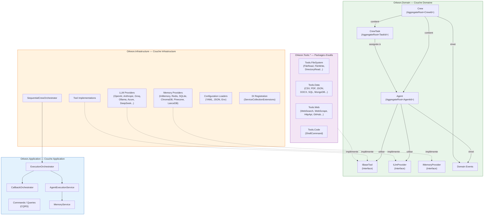

> 🇬🇧 [English version](../../getting-started/overview.md)

# Vue d'ensemble d'Orkeon

> **Voir aussi** : [Bootstrap et exécution](./bootstrap.md) · [YAML et Builders](./yaml-and-builders.md) · [Retour à l'index](../INDEX.md)

## Qu'est-ce qu'Orkeon ?

Orkeon est un framework C#/.NET pour l'orchestration d'équipes d'agents IA collaboratifs. Il permet de définir des agents spécialisés, de leur assigner des tâches, de les équiper d'outils et de les faire collaborer au sein d'une *Crew* (équipe) orchestrée selon différentes stratégies d'exécution.

Le framework suit une architecture Clean Architecture / DDD et cible .NET 10.

## Diagramme d'architecture



## Concepts fondamentaux

### Agent (`Orkeon.Domain.Agent.Agent`)

Un Agent est l'unité de travail intelligente du framework. C'est un *Aggregate Root* DDD identifié par un `AgentId`. Un agent est défini par trois éléments obligatoires : un **rôle** (`AgentRole`), un **objectif** (`AgentGoal`), et optionnellement un **backstory** (`AgentBackstory`) qui contextualise sa personnalité pour le LLM.

Chaque agent possède une liste d'outils (`IReadOnlyList<ITool> Tools`), un statut (`AgentStatus` : Idle ou Busy), des contraintes d'exécution (`MaxIterations`, `MaxRpm`, `MaxExecutionTime`), et peut être configuré pour déléguer des tâches (`AllowDelegation`).

Il n'y a qu'une seule classe `Agent` — le comportement de manager en mode hiérarchique est géré par l'interface `IManagerAgent` et son implémentation `LlmBasedManager`.

```csharp
var agent = new AgentBuilder()
    .Role("Data Analyst")
    .Goal("Analyze sales data and produce insights")
    .Backstory("Senior analyst with 10 years of retail experience")
    .WithTool(csvReaderTool)
    .WithTool(jsonTool)
    .MaxIterations(15)
    .Verbose()
    .Build();
```

### Task (`Orkeon.Domain.Task.CrewTask`)

Une Task (ou `CrewTask`) représente une unité de travail assignable à un agent. Elle est définie par une **description** (`TaskDescription`) et un **résultat attendu** (`ExpectedOutput`). Les tasks supportent les dépendances inter-tâches (`Dependencies`), l'exécution asynchrone (`AsyncExecution`), la validation par schéma JSON (`OutputJson`), et la demande d'intervention humaine (`HumanInput`).

```csharp
var task = new CrewTaskBuilder()
    .Description("Analyze Q4 sales CSV and identify top 3 trends")
    .ExpectedOutput("Markdown report with 3 trends and supporting data")
    .Priority(TaskPriority.High)
    .AssignTo(analyst)
    .Build();
```

### Tool (`Orkeon.Domain.Tools.IBaseTool`)

Un Tool est une capacité concrète mise à disposition d'un agent. L'interface `IBaseTool` expose un `Name`, une `Description`, un `Schema` (JSON schema des paramètres), et deux méthodes d'exécution : `CallAsync` (protocole structuré via `ToolCallRequest`/`ToolCallResponse`) et `ExecuteAsync` (mode legacy string).

Les outils sont organisés en packages NuGet spécialisés : `Orkeon.Tools.FileSystem`, `Orkeon.Tools.Data`, `Orkeon.Tools.Web`, `Orkeon.Tools.Code`.

### Crew (`Orkeon.Domain.Crew.Crew`)

Une Crew est une équipe d'agents organisée autour d'un **objectif commun** (`CrewGoal`). Elle définit la stratégie d'exécution via `ProcessType` et coordonne l'exécution des tasks par les agents.

```csharp
var crew = new CrewBuilder()
    .Goal("Produce weekly sales report")
    .Sequential()
    .WithAgent(analyst)
    .WithAgent(writer)
    .WithTask(analysisTask)
    .WithTask(reportTask)
    .Planning(true)
    .EnableMemory(true)
    .Build();
```

## Deux approches de définition : YAML ou Fluent Builder

Les Crews et leurs agents peuvent être définis de deux manières : soit via un fichier **YAML**, soit via l'API **Fluent Builder** en C#. Les deux approches produisent des résultats identiques.

### Approche 1 : Définition via YAML

Voici un exemple complet d'une Crew YAML pour générer un rapport de ventes :

```yaml
name: "sales-report-crew"
goal: "Produce weekly sales analysis report"
process: "sequential"
verbose: true
memory: true
planning: true

agents:
  data_analyst:
    role: "Sales Data Analyst"
    goal: "Extract and analyze sales metrics from the database"
    backstory: |
      Senior data analyst with 10 years of retail experience.
      Expert in SQL and statistical analysis.
    tools:
      - "relational_database_query"
      - "csv_reader"
    maxIter: 10
    maxRpm: 15

  report_writer:
    role: "Report Writer"
    goal: "Transform analysis results into a clear executive report"
    backstory: |
      Business communications specialist who turns data insights
      into actionable executive summaries.
    tools:
      - "file_write"
    maxIter: 5

tasks:
  analyze_sales:
    description: |
      Query the sales database for the last 7 days.
      Calculate: total revenue, top 5 products by units sold,
      week-over-week growth rate. Return structured JSON.
    expectedOutput: "JSON object with revenue, top_products array, and growth_rate"
    agent: "data_analyst"

  write_report:
    description: |
      Using the sales analysis data, write an executive report
      in Markdown format. Include an executive summary,
      key metrics table, and 3 actionable recommendations.
    expectedOutput: "Markdown report saved to /output/weekly-report.md"
    agent: "report_writer"
    dependencies:
      - "analyze_sales"
    outputFile: "/output/weekly-report.md"
```

### Approche 2 : Définition via Fluent Builder

L'équivalent en C# avec l'API Fluent Builder :

```csharp
// Créer les agents
var analyst = new AgentBuilder()
    .Role("Sales Data Analyst")
    .Goal("Extract and analyze sales metrics from the database")
    .Backstory("Senior data analyst with 10 years of retail experience. Expert in SQL and statistical analysis.")
    .WithTool(relationalDatabaseQueryTool)
    .WithTool(csvReaderTool)
    .MaxIterations(10)
    .MaxRpm(15)
    .Build();

var writer = new AgentBuilder()
    .Role("Report Writer")
    .Goal("Transform analysis results into a clear executive report")
    .Backstory("Business communications specialist who turns data insights into actionable executive summaries.")
    .WithTool(fileWriteTool)
    .MaxIterations(5)
    .Build();

// Créer les tasks
var analyzeTask = new CrewTaskBuilder()
    .Description("Query the sales database for the last 7 days. Calculate: total revenue, top 5 products by units sold, week-over-week growth rate. Return structured JSON.")
    .ExpectedOutput("JSON object with revenue, top_products array, and growth_rate")
    .AssignTo(analyst)
    .Build();

var reportTask = new CrewTaskBuilder()
    .Description("Using the sales analysis data, write an executive report in Markdown format. Include an executive summary, key metrics table, and 3 actionable recommendations.")
    .ExpectedOutput("Markdown report saved to /output/weekly-report.md")
    .AssignTo(writer)
    .DependsOn(analyzeTask)
    .Build();

// Créer la Crew
var crew = new CrewBuilder()
    .Goal("Produce weekly sales analysis report")
    .Sequential()
    .WithAgent(analyst)
    .WithAgent(writer)
    .WithTask(analyzeTask)
    .WithTask(reportTask)
    .Planning(true)
    .EnableMemory(true)
    .Verbose(true)
    .Build();
```

## Communication inter-agents

La communication entre agents est gérée par le système de protocoles défini dans `CommunicationProtocol` (`Orkeon.Domain.SharedKernel.ValueObjects`).

Quatre types de protocoles sont disponibles via `ProtocolType` :

| Protocole | Factory | Mode | Usage |
|-----------|---------|------|-------|
| **Direct** | `CommunicationProtocol.Direct` | Synchrone | Communication point-à-point entre deux agents |
| **Broadcast** | `CommunicationProtocol.Broadcast` | Synchrone | Diffusion d'un message à tous les agents d'une crew |
| **MessageQueue** | `CommunicationProtocol.MessageQueue` | Asynchrone | File de messages pour communication découplée |
| **EventStream** | `ProtocolType.EventStream` | Asynchrone | Flux d'événements en streaming |

L'implémentation concrète est assurée par `AsyncAgentCommunicationService` (`Orkeon.Infrastructure.Communication`) qui expose `SendMessageAsync`, `ReceiveMessagesAsync` et `IsAgentAvailableAsync`.

La collaboration entre agents est également supportée au niveau domaine : `Agent.CollaborateWith(AgentId, TaskId)` initie une collaboration et émet un `AgentCollaborationStartedEvent`. La délégation est gérée par les outils `AskQuestionTool` et `DelegateWorkTool`.

## Structure du projet

```
Orkeon.sln
├── src/                            # 33 projets, 11 zones
│   ├── core/
│   │   ├── Orkeon.Domain/          # Entités, value objects, interfaces, événements
│   │   ├── Orkeon.Application/     # CQRS, services, orchestration, ports
│   │   └── Orkeon.Infrastructure/  # Implémentations, providers LLM, mémoire, DI
│   ├── tools/                      # 9 packs d'outils
│   │   ├── Orkeon.Tools.Abstractions/     # Classes de base des outils
│   │   ├── Orkeon.Tools.Analysis/         # Outils agents RaggableTree (15)
│   │   ├── Orkeon.Tools.Code/             # Outils code (ShellCommand)
│   │   ├── Orkeon.Tools.Data/             # Outils données (CSV, PDF, JSON, SQL, MongoDB…)
│   │   ├── Orkeon.Tools.Embeddings.Local/ # Embeddings locaux (BGE-micro ONNX)
│   │   ├── Orkeon.Tools.EventHub/         # Outils de messagerie EventHub
│   │   ├── Orkeon.Tools.FileSystem/       # Outils fichiers (Read, Write, Directory…)
│   │   ├── Orkeon.Tools.Rag/              # Outils agents RAG
│   │   └── Orkeon.Tools.Web/              # Outils web (Search, Scrape, HTTP, GitHub…)
│   ├── rag/                        # Sous-système RAG (Abstractions, Rag, Onnx, Onnx.Model)
│   ├── analysis/                   # Moteur RaggableTree (Abstractions, Analysis)
│   ├── scripting/                  # DSL .ork.ts (Orkeon.Scripting) + la CLI `orkeon` (Orkeon.Scripting.Cli)
│   ├── cli/                        # Briques CLI (Abstractions, Cli, Commands.Scripting, TerminalGui)
│   ├── hosting/                    # Orkeon.Hosting (RunnerHost)
│   ├── plugins/                    # Orkeon.Plugins (chargement de plugins au runtime)
│   ├── generators/                 # Orkeon.Generators (générateurs de source)
│   ├── analyzers/                  # Orkeon.Compliance.Vfs (analyseur Roslyn)
│   └── apps/
│       ├── Orkeon.ConsoleApp/      # REPL interactif (`orkeon-repl`)
│       └── Orkeon.Studio.*/        # Orkeon Studio (Config, Core, Run, Wpf)
├── tests/                          # Miroir de src/ (33 projets) + e2e, examples, shared
├── examples/                       # 105 exemples embarqués (9 catégories + vitrines)
└── docs/                           # Documentation (EN + miroir docs/fr)
```
