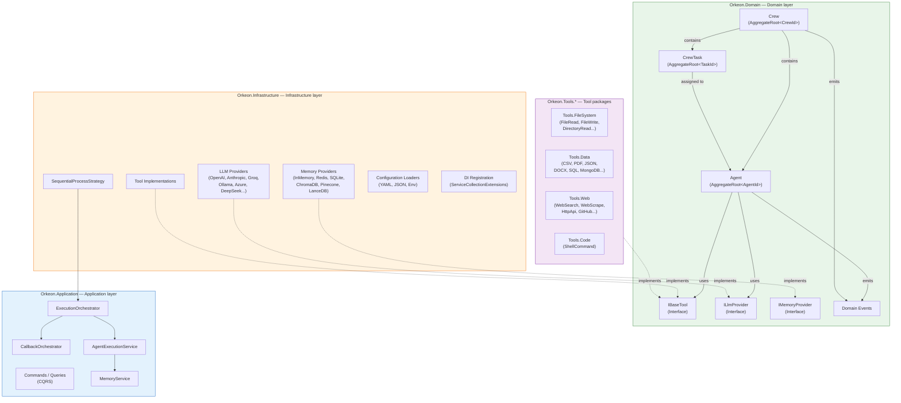

> 🇫🇷 [Version française](../fr/getting-started/overview.md)

# Orkeon Overview

> **See also**: [Bootstrap and execution](./bootstrap.md) · [YAML and Builders](./yaml-and-builders.md) · [Back to the index](../INDEX.md)

## What is Orkeon?

Orkeon is a C#/.NET framework for orchestrating teams of collaborative AI agents. It lets you define specialized agents, assign them tasks, equip them with tools and have them collaborate within a *Crew* (team) orchestrated according to different execution strategies.

The framework follows a Clean Architecture / DDD architecture and targets .NET 10.

## Architecture diagram



## Core concepts

### Agent (`Orkeon.Domain.Agent.Agent`)

An Agent is the intelligent unit of work of the framework. It is a DDD *Aggregate Root* identified by an `AgentId`. An agent is defined by three mandatory elements: a **role** (`AgentRole`), a **goal** (`AgentGoal`), and optionally a **backstory** (`AgentBackstory`) which contextualizes its personality for the LLM.

Each agent has a list of tools (`IReadOnlyList<ITool> Tools`), a status (`AgentStatus`: Idle or Busy), execution constraints (`MaxIterations`, `MaxRpm`, `MaxExecutionTime`), and can be configured to delegate tasks (`AllowDelegation`).

There is only one `Agent` class — the manager behavior in hierarchical mode is handled by the `IManagerAgent` interface and its `LlmBasedManager` implementation.

```csharp
var agent = new AgentBuilder()
    .Role("Data Analyst")
    .Goal("Analyze sales data and produce insights")
    .Backstory("Senior analyst with 10 years of retail experience")
    .WithTool(csvReaderTool)
    .WithTool(jsonTool)
    .MaxIterations(15)
    .Verbose()
    .Build();
```

### Task (`Orkeon.Domain.Task.CrewTask`)

A Task (or `CrewTask`) represents a unit of work assignable to an agent. It is defined by a **description** (`TaskDescription`) and an **expected output** (`ExpectedOutput`). Tasks support inter-task dependencies (`Dependencies`), asynchronous execution (`AsyncExecution`), JSON schema validation (`OutputJson`), and requesting human intervention (`HumanInput`).

```csharp
var task = new CrewTaskBuilder()
    .Description("Analyze Q4 sales CSV and identify top 3 trends")
    .ExpectedOutput("Markdown report with 3 trends and supporting data")
    .Priority(TaskPriority.High)
    .AssignTo(analyst)
    .Build();
```

### Tool (`Orkeon.Domain.Tools.IBaseTool`)

A Tool is a concrete capability made available to an agent. The `IBaseTool` interface exposes a `Name`, a `Description`, a `Schema` (JSON schema of the parameters), and two execution methods: `CallAsync` (structured protocol via `ToolCallRequest`/`ToolCallResponse`) and `ExecuteAsync` (legacy string mode).

Tools are organized into specialized NuGet packages: `Orkeon.Tools.FileSystem`, `Orkeon.Tools.Data`, `Orkeon.Tools.Web`, `Orkeon.Tools.Code`.

### Crew (`Orkeon.Domain.Crew.Crew`)

A Crew is a team of agents organized around a **common goal** (`CrewGoal`). It defines the execution strategy via `ProcessType` and coordinates the execution of the tasks by the agents.

```csharp
var crew = new CrewBuilder()
    .Goal("Produce weekly sales report")
    .Sequential()
    .WithAgent(analyst)
    .WithAgent(writer)
    .WithTask(analysisTask)
    .WithTask(reportTask)
    .Planning(true)
    .EnableMemory(true)
    .Build();
```

## Two definition approaches: YAML or Fluent Builder

Crews and their agents can be defined in two ways: either via a **YAML** file, or via the **Fluent Builder** API in C#. Both approaches produce identical results.

### Approach 1: Definition via YAML

Here is a complete example of a YAML Crew that generates a sales report:

```yaml
name: "sales-report-crew"
goal: "Produce weekly sales analysis report"
process: "sequential"
verbose: true
memory: true
planning: true

agents:
  data_analyst:
    role: "Sales Data Analyst"
    goal: "Extract and analyze sales metrics from the database"
    backstory: |
      Senior data analyst with 10 years of retail experience.
      Expert in SQL and statistical analysis.
    tools:
      - "relational_database_query"
      - "csv_reader"
    maxIter: 10
    maxRpm: 15

  report_writer:
    role: "Report Writer"
    goal: "Transform analysis results into a clear executive report"
    backstory: |
      Business communications specialist who turns data insights
      into actionable executive summaries.
    tools:
      - "file_write"
    maxIter: 5

tasks:
  analyze_sales:
    description: |
      Query the sales database for the last 7 days.
      Calculate: total revenue, top 5 products by units sold,
      week-over-week growth rate. Return structured JSON.
    expectedOutput: "JSON object with revenue, top_products array, and growth_rate"
    agent: "data_analyst"

  write_report:
    description: |
      Using the sales analysis data, write an executive report
      in Markdown format. Include an executive summary,
      key metrics table, and 3 actionable recommendations.
    expectedOutput: "Markdown report saved to /output/weekly-report.md"
    agent: "report_writer"
    dependencies:
      - "analyze_sales"
    outputFile: "/output/weekly-report.md"
```

### Approach 2: Definition via Fluent Builder

The C# equivalent with the Fluent Builder API:

```csharp
// Create the agents
var analyst = new AgentBuilder()
    .Role("Sales Data Analyst")
    .Goal("Extract and analyze sales metrics from the database")
    .Backstory("Senior data analyst with 10 years of retail experience. Expert in SQL and statistical analysis.")
    .WithTool(relationalDatabaseQueryTool)
    .WithTool(csvReaderTool)
    .MaxIterations(10)
    .MaxRpm(15)
    .Build();

var writer = new AgentBuilder()
    .Role("Report Writer")
    .Goal("Transform analysis results into a clear executive report")
    .Backstory("Business communications specialist who turns data insights into actionable executive summaries.")
    .WithTool(fileWriteTool)
    .MaxIterations(5)
    .Build();

// Create the tasks
var analyzeTask = new CrewTaskBuilder()
    .Description("Query the sales database for the last 7 days. Calculate: total revenue, top 5 products by units sold, week-over-week growth rate. Return structured JSON.")
    .ExpectedOutput("JSON object with revenue, top_products array, and growth_rate")
    .AssignTo(analyst)
    .Build();

var reportTask = new CrewTaskBuilder()
    .Description("Using the sales analysis data, write an executive report in Markdown format. Include an executive summary, key metrics table, and 3 actionable recommendations.")
    .ExpectedOutput("Markdown report saved to /output/weekly-report.md")
    .AssignTo(writer)
    .DependsOn(analyzeTask)
    .Build();

// Create the Crew
var crew = new CrewBuilder()
    .Goal("Produce weekly sales analysis report")
    .Sequential()
    .WithAgent(analyst)
    .WithAgent(writer)
    .WithTask(analyzeTask)
    .WithTask(reportTask)
    .Planning(true)
    .EnableMemory(true)
    .Verbose(true)
    .Build();
```

## Inter-agent communication

Communication between agents is handled by the protocol system defined in `CommunicationProtocol` (`Orkeon.Domain.SharedKernel.ValueObjects`).

Four protocol types are available via `ProtocolType`:

| Protocol | Factory | Mode | Usage |
|-----------|---------|------|-------|
| **Direct** | `CommunicationProtocol.Direct` | Synchronous | Point-to-point communication between two agents |
| **Broadcast** | `CommunicationProtocol.Broadcast` | Synchronous | Broadcasting a message to all agents in a crew |
| **MessageQueue** | `CommunicationProtocol.MessageQueue` | Asynchronous | Message queue for decoupled communication |
| **EventStream** | `ProtocolType.EventStream` | Asynchronous | Streaming event flow |

The concrete implementation is provided by `AsyncAgentCommunicationService` (`Orkeon.Infrastructure.Communication`) which exposes `SendMessageAsync`, `ReceiveMessagesAsync` and `IsAgentAvailableAsync`.

Collaboration between agents is also supported at the domain level: `Agent.CollaborateWith(AgentId, TaskId)` initiates a collaboration and emits an `AgentCollaborationStartedEvent`. Delegation is handled by the `AskQuestionTool` and `DelegateWorkTool` tools.

## Project structure

```
Orkeon.sln
├── src/                            # 33 projects, 11 zones
│   ├── core/
│   │   ├── Orkeon.Domain/          # Entities, value objects, interfaces, events
│   │   ├── Orkeon.Application/     # CQRS, services, orchestration, ports
│   │   └── Orkeon.Infrastructure/  # Implementations, LLM providers, memory, DI
│   ├── tools/                      # 9 tool packs
│   │   ├── Orkeon.Tools.Abstractions/     # Tool base classes
│   │   ├── Orkeon.Tools.Analysis/         # RaggableTree agent tools (15)
│   │   ├── Orkeon.Tools.Code/             # Code tools (ShellCommand)
│   │   ├── Orkeon.Tools.Data/             # Data tools (CSV, PDF, JSON, SQL, MongoDB…)
│   │   ├── Orkeon.Tools.Embeddings.Local/ # On-device embeddings (BGE-micro ONNX)
│   │   ├── Orkeon.Tools.EventHub/         # EventHub messaging tools
│   │   ├── Orkeon.Tools.FileSystem/       # File tools (Read, Write, Directory…)
│   │   ├── Orkeon.Tools.Rag/              # RAG agent tools
│   │   └── Orkeon.Tools.Web/              # Web tools (Search, Scrape, HTTP, GitHub…)
│   ├── rag/                        # RAG subsystem (Abstractions, Rag, Onnx, Onnx.Model)
│   ├── analysis/                   # RaggableTree engine (Abstractions, Analysis)
│   ├── scripting/                  # .ork.ts DSL (Orkeon.Scripting) + the `orkeon` CLI (Orkeon.Scripting.Cli)
│   ├── cli/                        # CLI building blocks (Abstractions, Cli, Commands.Scripting, TerminalGui)
│   ├── hosting/                    # Orkeon.Hosting (RunnerHost)
│   ├── plugins/                    # Orkeon.Plugins (runtime plugin loading)
│   ├── generators/                 # Orkeon.Generators (source generators)
│   ├── analyzers/                  # Orkeon.Compliance.Vfs (Roslyn analyzer)
│   └── apps/
│       ├── Orkeon.ConsoleApp/      # Interactive REPL (`orkeon-repl`)
│       └── Orkeon.Studio.*/        # Orkeon Studio (Config, Core, Run, Wpf)
├── tests/                          # Mirrors src/ (33 projects) + e2e, examples, shared
├── examples/                       # 105 bundled examples (9 categories + showcases)
└── docs/                           # Documentation (EN + docs/fr mirror)
```
