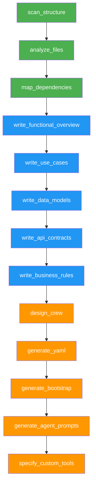

# 102. Analyse de Codebase TypeScript et Plan de Migration Orkeon

> Crew de 6 agents en 3 phases sequentielles qui analyse exhaustivement un codebase TypeScript, produit sa specification fonctionnelle complete, puis genere le plan de migration vers une architecture Orkeon.

## Quality

Exhaustivite — Inventaire fichier par fichier, specification fonctionnelle en 5 documents, plan de migration actionnable

## Architecture

- **Process**: `sequential`
- **Agents**: 6 — Codebase Explorer, Code Analyst, Dependency Mapper, Functional Analyst, Orkeon Architect, YAML Generator
- **Tools**: `directory_read`, `file_read`, `file_write`, `json_tool`
- **Memory**: `InMemory`
- **Key features**: 3-phase pipeline (inventory -> functional spec -> migration plan), Mermaid dependency graphs, UC/RG templates, YAML + C# generation
- **Runner**: `standard`

## Points de montage

La crew utilise deux points de montage pour separer clairement le code source de l'application analysee et les livrables generes (syntaxe Docker-style, cf. `SPEC-FILESYSTEM-SANDBOX.md` §3.1) :

| Declaration | Chemin virtuel | Droits | Role |
|-------------|---------------|--------|------|
| `<chemin_hote>:/src:ro` | `/src` | `ro` (lecture seule) | Racine du codebase TypeScript a analyser |
| `<chemin_hote>:/output:rw` | `/output` | `rw` (lecture-ecriture) | Repertoire de sortie des livrables |

## Prerequisites

1. .NET 10 SDK
2. Configure `appsettings.json` with your LLM API key
3. Preparer le repertoire contenant le codebase TypeScript a analyser
4. Preparer (ou creer) un repertoire vide pour les livrables de sortie

## Run

```bash
dotnet run --project examples/runners/standard -- \
  --config examples/06-engineering-devops/102-ts-codebase-documentation/config.yaml \
  --mount /home/cyril/my-ts-project:/src:ro \
  --mount /home/cyril/analysis-output:/output:rw
```

Windows :

```bash
dotnet run --project examples/runners/standard -- \
  --config examples/06-engineering-devops/102-ts-codebase-documentation/config.yaml \
  --mount C:\Projects\my-ts-project:/src:ro \
  --mount C:\temp\analysis-output:/output:rw
```

Le runner standard gere automatiquement : DI (Application + Infrastructure + toutes les suites d'outils), resolution du provider LLM depuis `appsettings.json`, `CrewFactory.CreateFromFileAsync()` et `KickoffAsync`.

## Grille de responsabilites

| Responsabilite | Categorie | Description |
|----------------|-----------|-------------|
| Scanner l'arborescence des fichiers TS | **Collecte** | Listing recursif avec filtrage et classification |
| Analyser le code source fichier par fichier | **Analyse** | Extraction des exports, imports, patterns, responsabilites |
| Cartographier les dependances | **Analyse** | Construction du graphe, detection de hubs et cycles |
| Rediger la specification fonctionnelle | **Production** | 5 documents : overview, use cases, data models, API, business rules |
| Concevoir l'architecture de la crew cible | **Decision** | Mapping responsabilites vers agents, choix ProcessType |
| Generer les livrables techniques | **Production** | YAML, C#, prompts, specs outils |

## Mapping agents / outils

| Responsabilite | Agent | Role | Outil(s) YAML | Effort |
|----------------|-------|------|---------------|--------|
| Scanner l'arborescence TS | `codebase_explorer` | TypeScript Codebase Explorer | `directory_read`, `file_read` | S |
| Analyser le code source | `code_analyst` | TypeScript Source Code Analyst | `file_read`, `file_write` | M |
| Cartographier les dependances | `dependency_mapper` | TypeScript Dependency Mapper | `file_read`, `json_tool`, `file_write` | S |
| Rediger la spec fonctionnelle | `functional_analyst` | Functional Specification Writer | `file_read`, `file_write` | L |
| Concevoir la crew cible | `orkeon_architect` | Orkeon Migration Architect | `file_read`, `file_write` | M |
| Generer les livrables techniques | `yaml_generator` | Orkeon Configuration Generator | `file_read`, `file_write` | L |

## ProcessType retenu

**Sequential** — Les 3 phases sont strictement sequentielles : Phase 1 (inventaire) doit etre complete avant Phase 2 (spec fonctionnelle), qui doit etre complete avant Phase 3 (plan de migration). Le mode Hierarchical n'apporte pas de valeur (pas de routing dynamique). Le mode Parallel n'est pas applicable (aucune task independante).

## Calibration des agents

| Agent | maxIter | maxRpm | allowDelegation | Justification |
|-------|---------|--------|-----------------|---------------|
| `codebase_explorer` | 30 | 15 | false | Scan recursif + classification, nombre modere d'operations |
| `code_analyst` | 100 | 20 | false | **Critique** : doit lire chaque fichier individuellement (estime 50 fichiers x 2 operations = 100) |
| `dependency_mapper` | 40 | 15 | false | Lecture d'un document + construction du graphe |
| `functional_analyst` | 80 | 15 | false | 5 documents sequentiels avec lectures croisees |
| `orkeon_architect` | 30 | 10 | false | Lecture de 5 documents + production d'un plan |
| `yaml_generator` | 60 | 10 | false | 4 livrables techniques sequentiels |

## Chaine de dependances



Legende : Vert = Phase 1 (Inventaire), Bleu = Phase 2 (Spec fonctionnelle), Orange = Phase 3 (Migration Orkeon)

## Outils natifs utilises

| Nom YAML | Classe | Package | Agents utilisateurs | Suite DI |
|----------|--------|---------|---------------------|----------|
| `directory_read` | `DirectoryReadTool` | `Orkeon.Tools.FileSystem` | `codebase_explorer` | `AddOrkeonFileSystemTools()` |
| `file_read` | `FileReadTool` | `Orkeon.Tools.FileSystem` | Tous les 6 agents | `AddOrkeonFileSystemTools()` |
| `file_write` | `FileWriteTool` | `Orkeon.Tools.FileSystem` | 5 agents (sauf `codebase_explorer`) | `AddOrkeonFileSystemTools()` |
| `json_tool` | `JsonTool` | `Orkeon.Tools.Data` | `dependency_mapper` | `AddOrkeonDataTools()` |

Aucun outil custom n'est requis pour cette crew. Les 4 outils natifs couvrent l'integralite des besoins : `file_read` lit tout fichier texte (TypeScript inclus), `directory_read` avec `recursive: true` et `pattern: "*.ts"` permet le scan exhaustif, `file_write` cree les livrables markdown/YAML/C# avec creation automatique des dossiers parents, et `json_tool` en mode `parse`/`query` structure les donnees de dependances.

### Evolution future : quand un outil custom deviendrait necessaire

| Besoin futur | Base class recommandee | Justification |
|--------------|------------------------|---------------|
| Analyse AST TypeScript (extraction programmatique des imports/exports) | `ToolBase<>` | Calcul pur, pas d'I/O fichier ni HTTP |
| Integration avec un registre npm pour verifier les versions de dependances | `HttpToolBase<>` | Appel API REST externe avec protection SSRF |
| Generation de diagrammes Mermaid via API de rendu | `HttpToolBase<>` | Appel HTTP vers un service de rendu |
| Lecture de fichiers package.json / tsconfig.json avec validation de schema | `FileToolBase<>` | Operation fichier avec validation de chemin |

## Output

All generated documents are written to `/output` :

```
/output/
├── phase1/
│   ├── 01_inventory.md          — file listing + metadata
│   ├── 02_files_analysis.md     — per-file analysis (6 dimensions)
│   └── 03_dependency_map.md     — dependency graph (Mermaid)
├── phase2/
│   ├── 01_functional_overview.md
│   ├── 02_use_cases.md          — UC-NNN template
│   ├── 03_data_models.md        — ERD Mermaid + entity tables
│   ├── 04_api_contracts.md
│   └── 05_business_rules.md     — RG-NNN template
└── phase3/
    ├── 00_migration_plan.md     — responsibility -> agent mapping
    ├── 01_config.yaml           — generated Orkeon crew config
    ├── 02_bootstrap.cs          — generated Program.cs + DI
    ├── 03_agent_prompts.md      — detailed agent prompts
    └── tools/
        └── [tool_name].md       — custom tool specs (if any)
```

## Effort total estime

| Phase | Agents | Tasks | Effort |
|-------|--------|-------|--------|
| Phase 1 — Inventaire | 3 | 3 | M |
| Phase 2 — Spec fonctionnelle | 1 | 5 | L |
| Phase 3 — Migration Orkeon | 2 | 5 | L |
| **Total** | **6** | **13** | **L** |

## What this example demonstrates

- Multi-phase sequential crew with inter-phase dependencies
- Automated codebase analysis without AST tooling (LLM-driven)
- Functional specification generation from technical analysis
- Self-referential Orkeon crew generation (crew that designs another crew)
- Calibration of MaxIterations based on estimated file count
- Clean separation of input (`/src:ro`) and output (`/output:rw`) via Docker-style mount points
